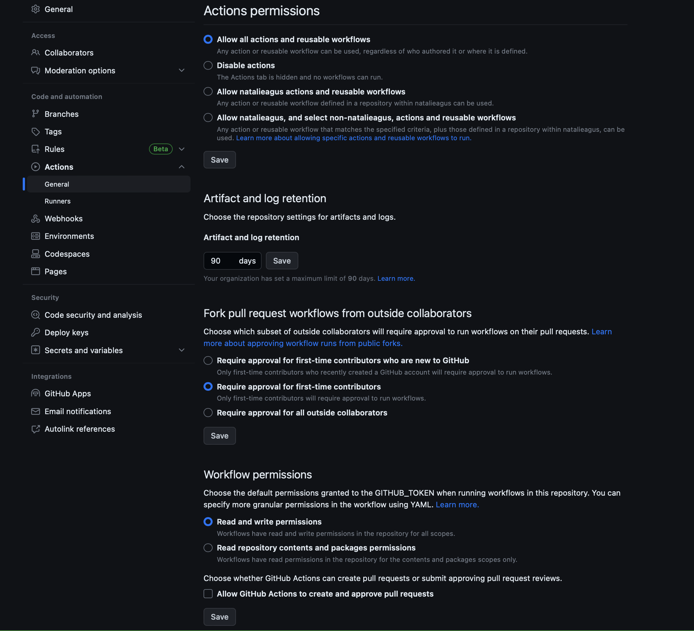

# 50.033 Game Design and Development

This is an experimental course website for 50.033 Game Design and Development module.

You can contribute by forking this repository and creating pull requests 😊

## Getting started

1. Clone this project, then `npm install --legacy-peer-deps`
2. Afterwards, type `npm start`
3. You can publish this site to github automatically by pushing this to your `master` branch. See `.github/workflows/deploy.yml` action script
4. You need to give **read and write** Action permission in your workflow
   
5. Edit `docusaurus.config.js` accordingly to use on your site and deploy it on your repo, namely the `baseUrl`
6. The file `src/pages/index.js` contains the homepage. Edit it to your liking.

## Custom modifications

1. Add icons to /static/img
2. Installed local search `npm install --save @easyops-cn/docusaurus-search-local`
3. enable math `npm install --save remark-math@3 rehype-katex@5 hast-util-is-element@1.1.0`
4. enable brython `npm i docusaurus-live-brython`
5. add docs plugin to have docs on another folder `npm install --save @docusaurus/plugin-content-docs`
6. Add setting to the docusaurus search local to include other docs route base path like psets labs etc that's defined in (5)
7. Swizzled Admonitions: see `docusaurus.config.js`
8. Custom components: see `src/components`

## Markdown features

### Admonitions

You can generate admonitions using:

```
:::[keyword]
<your content>
:::
```

where `[keyword]` can be any of the following:

```
keywords: [
    "info",
    "success",
    "danger",
    "note",
    "tip",
    "warning",
    "important",
    "caution",
    "keyword",
    "think",
],
```

Edit `/src/theme/Admonition.index.js` to add more custom admonition, and add it in `docusaurus.config.js`.

### Custom markdown snippets and Keybinding

It's advisable to add custom markdown snippets as follows in your VSCode's `markdown.json`:

````
...
  "Red block": {
    "prefix": "redwords",
    "body": [
      "<span style={{ \"color\":\"red\", \"fontWeight\": \"bold\" }}>$TM_SELECTED_TEXT$1</span>"
    ],
    "description": "custom redword block"
  },
    "Image Block React": {
    "prefix": "imageblockreact",
    "body": [
      "<ImageCard path={require(\"./$1\").default} widthPercentage=\"70%$2\"/>"
    ],
    "description": "custom image block in React"
  },
  "Image Block React With Prefix": {
    "prefix": "imageblockreactwithprefix",
    "body": [
      "<ImageCard path={require(\"./images/$1\").default} widthPercentage=\"70%$2\"/>"
    ],
    "description": "custom image block in React with prefix"
  },
  "Deep Dive React": {
    "prefix": "deepdivereact",
    "body": [
      "<DeepDive title=\"Show Pseudocode\">\n\n$1\n```\n$2\n```\n\n</DeepDive>\n$3"
    ],
    "description": "custom deepdive block in React"
  },
  "Front Matter MDX": {
    "prefix": "frontmattermdx",
    "body": [
      "---\nsidebar_position: $1\n---\n\nimport CollapsibleAnswer from '@site/src/components/CollapsibleAnswer';\nimport DeepDive from '@site/src/components/DeepDive';\nimport ImageCard from '@site/src/components/ImageCard';\nimport ChatBaseBubble from \"@site/src/components/ChatBaseBubble\";\n\n$2\n\n<ChatBaseBubble/>\n\n$3"
    ],
    "description": "custom yaml frontmatter block"
  },
  "Keywords React": {
    "prefix": "keywordsreact",
    "body": [":::keyword Keywords\n$1\n:::"],
    "description": "custom keyword admonition"
  },
  "Admonitions React": {
    "prefix": "admonitionsreact",
    "body": [":::$1\n$2\n:::"],
    "description": "shortcut admonition"
  }
  ...
````

Then bind it to a keyboard shortcut in VSCode's `keybindings.json`:

```
...
  {
    "key": "ctrl+alt+e",
    "command": "editor.action.insertSnippet",
    "args": {
      "name": "Image Block React"
    },
    "when": "editorTextFocus && markdownShortcuts:enabled"
  },
  {
    "key": "ctrl+alt+g",
    "command": "editor.action.insertSnippet",
    "args": {
      "name": "Image Block React With Prefix"
    },
    "when": "editorTextFocus && markdownShortcuts:enabled"
  },
  {
    "key": "ctrl+alt+d",
    "command": "editor.action.insertSnippet",
    "args": {
      "name": "Deep Dive React"
    },
    "when": "editorTextFocus && markdownShortcuts:enabled"
  },
  {
    "key": "ctrl+alt+f",
    "command": "editor.action.insertSnippet",
    "args": {
      "name": "Front Matter MDX"
    },
    "when": "editorTextFocus && markdownShortcuts:enabled"
  },
  {
    "key": "ctrl+alt+o",
    "command": "editor.action.insertSnippet",
    "args": {
      "name": "Keywords React"
    },
    "when": "editorTextFocus && markdownShortcuts:enabled"
  },
  ...
```

### Images

Images should be placed in the same directory as the markdown file, inside `/images` folder. See `/docs` for reference.

VSCode extension: `mushan.vscode-paste-image` is immensely useful. [You can install it from here](https://marketplace.visualstudio.com/items?itemName=mushan.vscode-paste-image).

You can then bind it to some key to paste image on your clipboard:

```
  {
    "key": "ctrl+alt+v",
    "command": "extension.pasteImage",
    "when": "editorTextFocus"
  },
```

Then set the extension settings as follows:


This way, the extension is going to paste simply the path from current working directory, like `/images/bfs/2023-07-13-10-58-22.png` into `ImageBlock` component.

## Adding new folder

Lecture notes goes to `docs` folder by default. But, you can create new folder in the root, such as `projects`, `labs`, etc. First, create an entry point: `intro.md` (or any other name, just match it when declaring it in docusaurus config later) inside the new folder.

Now update `docusaurus.config.js`.

**Step 1**: register it under `@docusaurus/plugin-content-docs`:

```
  plugins: [
    [
      "@docusaurus/plugin-content-docs",
      {
        id: "projects",
        path: "projects",
        routeBasePath: "projects",
        sidebarPath: require.resolve("./sidebars.js"),
      },
    ],
    [
      "@docusaurus/plugin-content-docs",
      {
        id: "your-folder-name",
        path: "your-folder-name",
        routeBasePath: "your-folder-name",
        sidebarPath: require.resolve("./sidebars.js"),
      },
    ],
```

**Step 2**: under `themes`, register it as `docsRouteBasePath`:

```
  themes: [
    [
      require.resolve("@easyops-cn/docusaurus-search-local"),
      {
        docsRouteBasePath: ["projects", "docs", "about", "your-folder-name..."],
      },
    ],
```

**Step 3**: update the navbar to include your new folder:

```
      navbar: {
        hideOnScroll: true,
        title: "50.033,
        logo: {
          alt: "GDD Logo",
          src: "img/home-logo.svg",
        },
        items: [
          {
            type: "search",
            position: "right",
          },
          {
            to: "/about/intro",
            label: "About",
            position: "left",
            activeBaseRegex: `/about/`,
          },
          {
            to: "/your-folder-name/intro",
            label: "Navbar-Label",
            position: "left",
            activeBaseRegex: `/your-folder-name/`,
          },
          ...
        ]
        ...
      }
```
