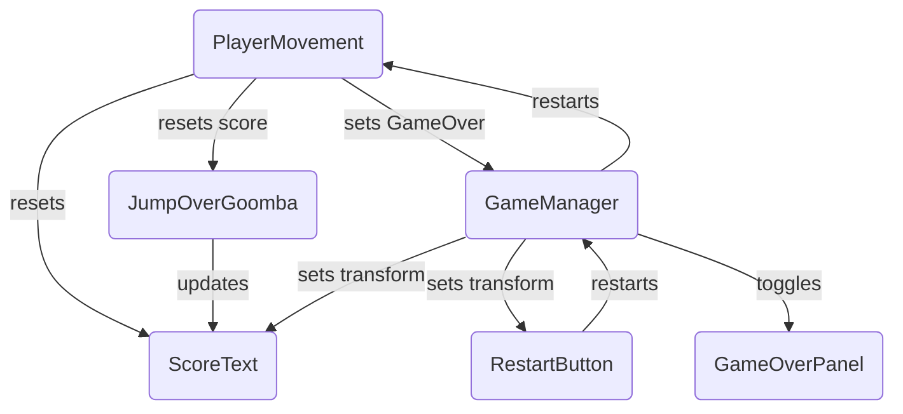
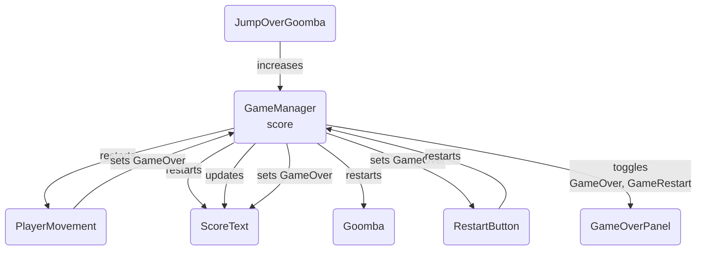

import CollapsibleAnswer from '@site/src/components/CollapsibleAnswer';
import DeepDive from '@site/src/components/DeepDive';
import ImageCard from '@site/src/components/ImageCard';
import ChatBaseBubble from '@site/src/components/ChatBaseBubble';
import VideoItem from '@site/src/components/VideoItem';
import Tabs from '@theme/Tabs';
import TabItem from '@theme/TabItem';

# The Observer Pattern

[The Observer Pattern](https://refactoring.guru/design-patterns/observer) is a software design pattern that allows you to create modular game logic that is executed when an event in the game is triggered. It typically works by allowing **observers**, in this case, other **scripts**, to subscribe one or more of their own functions to a subject’s event.

## Refactor PlayerMovement

We are now ready to utilise the new input system to control Mario's movement. Let's refactor a few methods in `PlayerMovement.cs`. Firstly, take out the code at `Update()` that flips Mario's sprite to face left or right into a new method that takes in an integer. If that integer is `-1`, it means that Mario should face left and we flip the sprite if he's initially facing right, and vice versa. Then, we also refactor `FixedUpdate()` to separate the the logic of moving Mario and making Mario Jump.

<Tabs>
<TabItem value="1" label="FlipMarioSprite()">

```cs title="PlayerMovement.cs"

    void Update()
    {
        marioAnimator.SetFloat("xSpeed", Mathf.Abs(marioBody.velocity.x));
    }

//highlight-start
    void FlipMarioSprite(int value)
    {
        if (value == -1 && faceRightState)
        {
            faceRightState = false;
            marioSprite.flipX = true;
            if (marioBody.velocity.x > 0.05f)
                marioAnimator.SetTrigger("onSkid");

        }

        else if (value == 1 && !faceRightState)
        {
            faceRightState = true;
            marioSprite.flipX = false;
            if (marioBody.velocity.x < -0.05f)
                marioAnimator.SetTrigger("onSkid");
        }
    }

    //highlight-end
```

</TabItem>

<TabItem value="2" label="MoveCheck(int value)">

```cs title="PlayerMovement.cs"
//highlight-start
    private bool moving = false;
//highlight-end
    void FixedUpdate()
    {
        //highlight-start
        if (alive && moving)
        //highlight-end
        {
            Move(faceRightState == true ? 1 : -1);
        }
    }

//highlight-start
    void Move(int value)
    {

        Vector2 movement = new Vector2(value, 0);
        // check if it doesn't go beyond maxSpeed
        if (marioBody.velocity.magnitude < maxSpeed)
            marioBody.AddForce(movement * speed);
    }

    public void MoveCheck(int value)
    {
        if (value == 0)
        {
            moving = false;
        }
        else
        {
            FlipMarioSprite(value);
            moving = true;
            Move(value);
        }
    }
    //highlight-end

```

</TabItem>

<TabItem value="3" label="Jump()">

```cs
    private bool jumpedState = false;

    public void Jump()
    {
        if (alive && onGroundState)
        {
            // jump
            marioBody.AddForce(Vector2.up * upSpeed, ForceMode2D.Impulse);
            onGroundState = false;
            jumpedState = true;
            // update animator state
            marioAnimator.SetBool("onGround", onGroundState);

        }
    }

```

</TabItem>

<TabItem value="4" label="JumpHold()">

```cs

    public void JumpHold()
    {
        if (alive && jumpedState)
        {
            // jump higher
            marioBody.AddForce(Vector2.up * upSpeed * 30, ForceMode2D.Force);
            jumpedState = false;

        }
    }


```

</TabItem>

</Tabs>

:::important
Notice how `MoveCheck`, `Jump` and `JumpHold` are declared as `public`? That's on purpose. This is because we want to register them with `UnityEvent` later on.
:::

The idea is as follows:

1. When `move` action is performed, we want to call `Move(value)` where `value` is 1 or -1 depending on whether Mario is moving to the right of to the left.
2. When `move` action is canceled, we want to call `Move(0)`

We could do this by **referencing** Mario's PlayerMovement script and call the methods manually, **or** by using **Events**. In particular, we are going to implement the **observer pattern** using **UnityEvent**.

When the event is triggered by the owner or whoever `Invoke()` it, the observers’ functions are called in response. So for instance, when `move` action is cancelled, it will invoke a `moveCheck` Event. Any methods subcribed to `moveCheck` will be called in sequence.

### UnityEvent

Unity events are a way to hook up function calls between GameObjects in the editor and **serialize** those calls. They are designed to be populated by developer at design-time. Create a new scipt (if you haven't already) called `ActionManager.cs` and attach it to Mario:

```cs

using UnityEngine;
using UnityEngine.Events;
using UnityEngine.InputSystem;

public class ActionManager : MonoBehaviour
{
    public UnityEvent jump;
    public UnityEvent jumpHold;
    public UnityEvent<int> moveCheck;

    public void OnJumpHoldAction(InputAction.CallbackContext context)
    {
        if (context.started)
            Debug.Log("JumpHold was started");
        else if (context.performed)
        {
            Debug.Log("JumpHold was performed");
            Debug.Log(context.duration);
            jumpHold.Invoke();
        }
        else if (context.canceled)
            Debug.Log("JumpHold was cancelled");
    }

    // called twice, when pressed and unpressed
    public void OnJumpAction(InputAction.CallbackContext context)
    {
        if (context.started)
            Debug.Log("Jump was started");
        else if (context.performed)
        {
            jump.Invoke();
            Debug.Log("Jump was performed");
        }
        else if (context.canceled)
            Debug.Log("Jump was cancelled");

    }

    // called twice, when pressed and unpressed
    public void OnMoveAction(InputAction.CallbackContext context)
    {
        // Debug.Log("OnMoveAction callback invoked");
        if (context.started)
        {
            Debug.Log("move started");
            int faceRight = context.ReadValue<float>() > 0 ? 1 : -1;
            moveCheck.Invoke(faceRight);
        }
        if (context.canceled)
        {
            Debug.Log("move stopped");
            moveCheck.Invoke(0);
        }

    }
}

```

We assume you used **Invoke Unity Events** behavior in `Player Input` component as shown:

<ImageCard path={require("./images/management/2023-08-11-16-08-44.png").default} widthPercentage="100%"/>

Then, **serialize** the three events: Jump, JumpHold, and MoveCheck at the inspector to call the relevant functions in `PlayerMovement.cs` script:

<ImageCard path={require("./images/management/2023-08-11-16-09-48.png").default} widthPercentage="100%"/>

Don't forget to use **Dynamic** parameter:

<ImageCard path={require("./images/management/2023-08-11-16-10-15.png").default} widthPercentage="100%"/>

If we did not set `MoveCheck` to be **public**, then we would not be able to select that function from the inspector. What we did above is declare three events that will be **invoked** whenever there's **interaction**. for instance, we call `jump.Invoke()` under `OnJumpAction` callback, but only when `context.performed` is `true`. This will in turn call the method `Jump()` defined in `PlayerMovement.cs`.

The method `MoveCheck(int value)` takes in one `int` parameter, and so we need to use UnityEvent with **generic** type, and declare it as `public UnityEvent<int> moveCheck`.

:::playtest
Save and test that Mario can still move, skid, etc, jump, along with higher jump when you hold the spacebar.
:::

<DeepDive title="Deep Dive: UnityEvent vs UnityAction">
Some of you might have heard about `UnityAction`. They're similar to UnityEvent. Here's an example that will lead into identical results:

<Tabs>
<TabItem value="1" label="UnityEvent">

```cs
class Game {
  public static UnityEvent OnLogin = new UnityEvent();
}

class LoginForm {
  Awake() {
    Login();
  }

  private void Login() {
     Game.OnLogin.Invoke();
  }
}

class Player {
  Awake() {
     Game.OnLogin.AddListener(OnLoggedIn);
  }

  private void OnLoggedIn() {
    isLogged = true;
  }
}
```

</TabItem>

<TabItem value="2" label="UnityAction">

```cs
class Game {
  public static UnityAction OnLogin = new delegate {};
}

class LoginForm {
  Awake() {
    Login();
  }

  private void Login() {
     Game.OnLogin();
  }
}

class Player {
  Awake() {
     Game.OnLogin += OnLoggedIn;
  }

  private void OnLoggedIn() {
    isLogged = true;
  }
}
```

</TabItem>
</Tabs>

The difference between the two is that `UnityEvent` show up on inspector and you can serialize `OnLogin` there, whereas `UnityAction` must be used solely from script. It comes down to _style_ choice.
</DeepDive>

### Detect Mouse Click

Although mouse click is not necessary in Super Mario Bros, let's try to capture the position of a mouse click on the Game screen for the sake of other games that you might create. Firstly, let's rename our control scheme into MarioActions because we no longer _just_ use the keyboard (it's good to give naming that makes sense). Then, edit the control scheme and add the **Mouse** device.

:::warning
If you don't add Mouse into the control scheme, you will not be able to detect mouse clicks!
:::

<VideoItem path={"https://50033.s3.ap-southeast-1.amazonaws.com/week-3/add-mousescheme.mp4"} widthPercentage="100%"/>

Then as shown in the video above, add an action called `click` that detects Left Button Mouse press. This alone however is insufficient to capture the "location" of the mouse. We want it to **also** report the location of the mouse click, and for this we need to create a **Binding with One Modifier**. A **modifier** is a condition that has to be held for **binding** to come through. Here we set the action to pass a **value** of control type **Vector2**, the Modifier as the Left Button mouse click, and the Binding as Mouse position.

> Please read the documentation about [bindings and modifiers here](https://docs.unity3d.com/Packages/com.unity.inputsystem@1.6/manual/ActionBindings.html#one-modifier).

<VideoItem path={"https://50033.s3.ap-southeast-1.amazonaws.com/week-3/binding-one-modifier.mp4"} widthPercentage="100%"/>

Now we can define **two more** callbacks in `ActionManager.cs`:

```cs


    public void OnClickAction(InputAction.CallbackContext context)
    {
        if (context.started)
            Debug.Log("mouse click started");
        else if (context.performed)
        {
            Debug.Log("mouse click performed");
        }
        else if (context.canceled)
            Debug.Log("mouse click cancelled");
    }

    public void OnPointAction(InputAction.CallbackContext context)
    {
        if (context.performed)
        {
            Vector2 point = context.ReadValue<Vector2>();
            Debug.Log($"Point detected: {point}");

        }
    }

```

:::playtest
Set the callbacks inside Player Input component, and test the mouse clicks in the console:

<VideoItem path={"https://50033.s3.ap-southeast-1.amazonaws.com/week-3/clickmouse.mp4"} widthPercentage="100%"/>
:::

### Why `ActionManager.cs`?

Can we implement the input system callbacks directly at `PlayerMovement.cs`? Yes, sure we can. It comes down to preference and principle: do you prefer separating the scripts between managing your actions state (deciding what to do depending on the `context` state) and **implementing** the game logic (deciding **how** to jump)? There's no right answer to any of this.

### Be Careful when Changing Method Name

If you happen to refactor your code and **change** the method name, e.g: `onJumpHoldAction` into `OnJumpHoldAction`, whatever you have set on the inspector <span className="orange-bold">will not</span> change with it. It will be written as **missing**:

<ImageCard path={require("./images/management/2023-08-11-17-45-00.png").default} widthPercentage="50%"/>

You have to fix it too in the inspector. This is very tedious, but so is creating everything via script. It's a give and take.

## Delegates

We used `UnityEvent` above as some kind of **function container** that we can `Invoke()` and then it will call all functions subcribed to it _in order_. We don't really see it in the example above because we only have **one** function subscribed to it as defined in the Inspector. Let's dive deeper into how it works.

:::info Delegate
A delegate is a reference pointer to a method. It allows us to treat method as a variable and pass method as a variable for a callback. When a delegate gets called, it notifies all methods that reference the delegate.

The basic idea behind them is exactly the same as a subscription magazine. Anyone can subscribe to the service and they will receive the update at the right time automatically.
:::

You can declare a delegate with the delegate keyword and specifies its signature (return type and parameters):

```cs
public delegate returnType MethodName (paramType1 paramName1, paramType2 paramName2, ...);
```

For example, something like this:

```cs
public delegate void SimpleGameEvent();
```

### C# Event

To allow other scripts to subscribe to this delegate, we need to create an instance of that delegate, using the `event` keyword:

```cs
public static event SimpleGameEvent IncreaseScore;
```

We can also use the delegate directly using its name without the `event` keyword:

```cs
public static SimpleGameEvent IncreaseScore;
```

:::info event keyword
Without the `event` keyword, `IncreaseScore` can be cast by anyone (unless it is not public, but that will mean that not every other script can subscribe to it). If we want <span className="orange-bold">only</span> the **owner** of the **delegate** to cast, then the event keyword is used.
:::

Since the event is declared as `static`, that means other scripts can subscribe to it via the Classname.

#### UnityEvent

We will **mainly** utilise `UnityEvent` instead of C# Event and delegates because the former allows us to conveniently set it up via the inspector and that it covers basic signatures that we need (return type of `void` and accept generic parameters, up to four).

### Increase Game Score with Coin

When Mario touches a box or brick with Coin, we are supposed to increase the game score. Right now the `score` state is stored in `JumpOverGoomba`. `PlayerMovement` **has** to reference this script in order to change its `score` during restart:

```cs title="PlayerMovement.cs"

    public void ResetGame()
    {
        // ... other instructions

        // reset Goomba
        foreach (Transform eachChild in enemies.transform)
        {
            eachChild.localPosition = eachChild.GetComponent<EnemyMovement>().startPosition;
        }

        //highlight-start
        // reset score
        jumpOverGoomba.score = 0;
//highlight-end

        // reset animation
        marioAnimator.SetTrigger("gameRestart");
        alive = true;

        // reset camera position
        gameCamera.position = new Vector3(0, 0, -10);
    }

```

`ScoreText` is also modified by three scripts separately: `GameManager`, `JumpOverGoomba`, and `PlayerMovement`. Here's a graph that illustrates referencing between scripts/GameObjects:



It's pretty messy right now:

- ScoreText is referenced by **three** different scripts
- PlayerMovement and GameManager controls each other
- GameManager does not "manage" the game: score is stored inside JumpOverGoomba

Let's fix it to something neater as follows:



### Major Refactoring using Events

We need to create **three** different **events**: `GameOver`, `GameStart`, `GameRestart`, and `ScoreChange` in `GameManager.cs` and let other scripts subscribe to it and update themselves accordingly. Create **two** new scripts: `HUDManager.cs` and `EnemyManager.cs` which will contain callbacks to subscribe to the events above:

:::warning
Do not <span className="orange-bold">blindly</span> copy paste the content of the methods below. Your actual implementation might vary, for instance you might not have the `GameOverPanel` in your implementation if you did not choose to do it for Checkoff 1. These files are for your reference only.
:::

<Tabs>
<TabItem value="3"  label="HUDManager.cs">

```cs
using System.Collections;
using System.Collections.Generic;
using UnityEngine;
using TMPro;

public class HUDManager : MonoBehaviour
{
    private Vector3[] scoreTextPosition = {
        new Vector3(-747, 473, 0),
        new Vector3(0, 0, 0)
        };
    private Vector3[] restartButtonPosition = {
        new Vector3(844, 455, 0),
        new Vector3(0, -150, 0)
    };

    public GameObject scoreText;
    public Transform restartButton;

    public GameObject gameOverPanel;
    // Start is called before the first frame update
    void Start()
    {
    }

    // Update is called once per frame
    void Update()
    {

    }

    public void GameStart()
    {
        // hide gameover panel
        gameOverPanel.SetActive(false);
        scoreText.transform.localPosition = scoreTextPosition[0];
        restartButton.localPosition = restartButtonPosition[0];
    }

    public void SetScore(int score)
    {
        scoreText.GetComponent<TextMeshProUGUI>().text = "Score: " + score.ToString();
    }


    public void GameOver()
    {
        gameOverPanel.SetActive(true);
        scoreText.transform.localPosition = scoreTextPosition[1];
        restartButton.localPosition = restartButtonPosition[1];
    }
}

```

</TabItem>

<TabItem value="4" label="EnemyManager.cs">

```cs
using System.Collections;
using System.Collections.Generic;
using UnityEngine;

public class EnemyManager : MonoBehaviour
{
    // Start is called before the first frame update
    void Start()
    {

    }

    // Update is called once per frame
    void Update()
    {

    }

    public void GameRestart()
    {
        foreach (Transform child in transform)
        {
            child.GetComponent<EnemyMovementWeek3>().GameRestart();
        }
    }
}

```

</TabItem>
</Tabs>

Then modify these existing files such that we no longer have to refer to **scripts** in inspector and we don't store `score` in `JumpOverGoomba.cs`:

<Tabs>
<TabItem value="1" label="GameManager.cs">

```cs
using System.Collections;
using System.Collections.Generic;
using UnityEngine;
using UnityEngine.Events;

public class GameManagerWeek3 : MonoBehaviour
{
    // events
    public UnityEvent gameStart;
    public UnityEvent gameRestart;
    public UnityEvent<int> scoreChange;
    public UnityEvent gameOver;

    private int score = 0;

    void Start()
    {
        gameStart.Invoke();
        Time.timeScale = 1.0f;
    }

    // Update is called once per frame
    void Update()
    {

    }

    public void GameRestart()
    {
        // reset score
        score = 0;
        SetScore(score);
        gameRestart.Invoke();
        Time.timeScale = 1.0f;
    }

    public void IncreaseScore(int increment)
    {
        score += increment;
        SetScore(score);
    }

    public void SetScore(int score)
    {
        scoreChange.Invoke(score);
    }


    public void GameOver()
    {
        Time.timeScale = 0.0f;
        gameOver.Invoke();
    }
}
```

</TabItem>

<TabItem value="2" label="PlayerMovement.cs">

```cs
    public void GameRestart()
    {
        // reset position
        marioBody.transform.position = new Vector3(-5.33f, -4.69f, 0.0f);
        // reset sprite direction
        faceRightState = true;
        marioSprite.flipX = false;

        // reset animation
        marioAnimator.SetTrigger("gameRestart");
        alive = true;

        // reset camera position
        gameCamera.position = new Vector3(0, 0, -10);
    }
```

</TabItem>

<TabItem value="5" label="JumpOverGoomba.cs">

```cs
    //highlight-start
    GameManager gameManager;
//highlight-end
    void Start(){
        //highlight-start
        gameManager = GameObject.FindGameObjectWithTag("Manager").GetComponent<GameManager>();
        //highlight-end
    }

    void FixedUpdate()
    {
        // when jumping, and Goomba is near Mario and we haven't registered our score
        if (!onGroundState && countScoreState)
        {
            if (Mathf.Abs(transform.position.x - enemyLocation.position.x) < 0.5f)
            {
                countScoreState = false;
                //highlight-start
                gameManager.IncreaseScore(1); //
                //highlight-end
            }
        }

    }

```

</TabItem>

<TabItem value="6" label="EnemyMovement.cs">

```cs

    public void GameRestart()
    {
        transform.localPosition = startPosition;
        originalX = transform.position.x;
        moveRight = -1;
        ComputeVelocity();
    }

```

</TabItem>
</Tabs>

:::caution important
There are many things to do, but the big idea is that we need to:

1. **Remove** storing score at `JumpOverGoomba.cs`
2. Remove **script** references in inspector except to `GameManager.cs` (see video below)

:::

<VideoItem path={"https://50033.s3.ap-southeast-1.amazonaws.com/week-3/setup-events.mp4"} widthPercentage="100%"/>

:::playtest
Your actual implementation may vary a little, such as the game restart and gameover scene that is part of Checkoff 1.
:::

### Animation Event Tool

Now that we have refactored everything to utilise Events as much as possible and removing direct references to scripts, we can register a **callback** via AnimationEvent when a coin spawn is triggered. Specifically, we want to call the `IncreaseScore(1)` method inside GameManager instance.

:::caution
Recall that AnimationEvent will only list out public methods with signature: return type `void` and zero argument only from scripts attached to that GameObject where the Animator component is? That means it will <span className="orange-bold">not</span> detect IncreaseScore method since that method is within GameManager and not Coin.
:::

To help us, we shall create a **helper** script. We name it `AnimationEventIntTool.cs`:

```cs title="AnimationEventIntTool.cs"
using System.Collections;
using System.Collections.Generic;
using UnityEngine;
using UnityEngine.Events;

public class AnimationEventIntTool : MonoBehaviour
{
    public int parameter;
    public UnityEvent<int> useInt;
    // Start is called before the first frame update
    void Start()
    {

    }

    // Update is called once per frame
    void Update()
    {

    }

    public void TriggerIntEvent()
    {

        useInt.Invoke(parameter); // safe to invoke even without callbacks

    }
}
```

Usage steps:

1. Attach the `AnimationEventIntTool.cs` to **all** coins.
   <ImageCard path={require("./images/observer-pattern/2023-08-16-09-26-20.png").default} widthPercentage="70%"/>
2. Then for all coins, modify its animation clip to trigger events at the end of it.
   <ImageCard path={require("./images/observer-pattern/2023-08-16-09-26-42.png").default} widthPercentage="70%"/>
3. Link up GameManager **instance** of this Scene to get the `IncreaseScore(int score)` callback at the inspector

In our demo below, we have two events (but you might just have this one, it's fine). Make sure you set it to call all your events from all scripts attached to the Coin.

<VideoItem path={"https://50033.s3.ap-southeast-1.amazonaws.com/week-3/setup-callback-coin.mp4"} widthPercentage="100%"/>

:::danger Setting Prefab value with Instance
In the beginning, we set GameManager's IncreaseScore into all Coin script, but we seem to have to do it again at 1:09. This is because we **apply** the changes to ALL question-box-coin prefab at 00:42.

GameManager IncreaseScore is a Scene **instance**, meaning that it does _not persist_. A prefab cannot refer to a script instance from another GameObjects that is <span className="orange-bold">NOT</span> part of the prefab, because it wouldn't know if that instance will exist in the scene that it's currently spawned at (yes, we can instantiate prefabs at any scene at runtime). That's why the blue line indicator besides all the prefab in the Hierarchy does not disappear even after we apply the changes to all prefabs:

<ImageCard path={require("./images/observer-pattern/2023-08-16-09-31-02.png").default} widthPercentage="50%"/>

We also need to manually set ALL coins to call IncreaseScore from this scene's GameManager instance, as you see in the beginning of the video or at 1:09.
:::

## Summary

We have seen how convenient it is to set callbacks via the inspector. However, if our callbacks come from another GameObject instance that's not part of the prefab's, then we would have to do that each time we instantiate a prefab.

Setting things up from the inspector (as opposed to from the script) can be a double-edged sword. On one hand: it is convenient and visually affirming, while on the other hand: it is easy to miss a few things or "forgot" to set it up.
