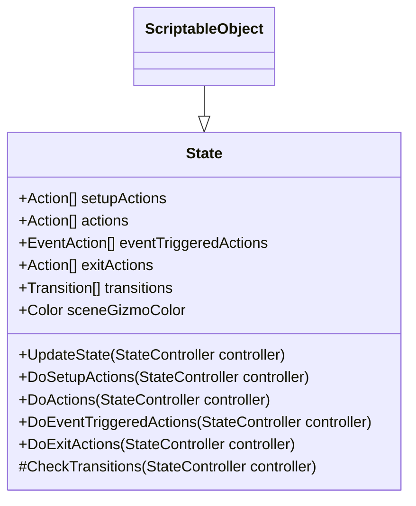
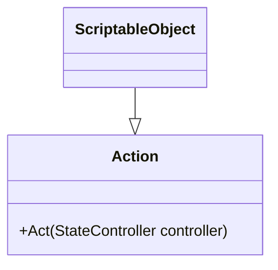
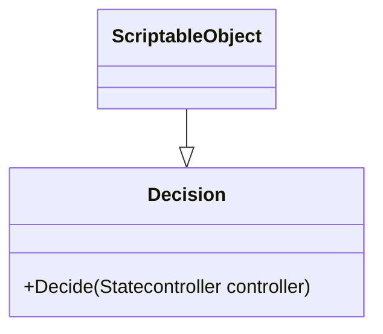

import CollapsibleAnswer from '@site/src/components/CollapsibleAnswer';
import DeepDive from '@site/src/components/DeepDive';
import ImageCard from '@site/src/components/ImageCard';
import ChatBaseBubble from '@site/src/components/ChatBaseBubble';
import VideoItem from '@site/src/components/VideoItem';
import Tabs from '@theme/Tabs';
import TabItem from '@theme/TabItem';

# Finite State Machine

A pluggable state machine implemented as a ScriptableObject in Unity is a **powerful** way to create <span className="orange-bold">flexible</span> and <span className="orange-bold">reusable</span> state-based logic for your game objects. It allows you to define custom data structures and behaviors that can be **shared** across multiple game objects.

We begin by creating a State, Action, and Transition SO. The State SO describes a list of **actions** that have to be done in that state, and takes in a list of **transitions** to determine the next state that we can go to. Then we need to create a StateMachineController to be attached to the GameObject we want to control with the state machine. In this part of the lab, we will create a simple FSM to control Mario's state upon receiving different types of Powerups and Buffs. There will be <span className="orange-bold">two</span> FSMs: one that will control Mario's regular state (appearance), and another one to control its Buffs.

We will follow the this basic idea for Mario's state:

<ImageCard path={require("./images/mario-fsm.png").default} customClass="invert-color" widthPercentage="50%"/>

As for Buffs, we have this simple construct:

<ImageCard path={require("./images/mario-fsm-buffs.png").default} customClass="invert-color" widthPercentage="30%"/>

## The Pluggable FSM Architecture

### State



<br/>

A `state` inherits SO, and is implemented as follows:

```cs title="State.cs"
using System;
using UnityEngine;

[CreateAssetMenu(menuName = "PluggableSM/State")]
public class State : ScriptableObject
{
    public Action[] setupActions;
    public Action[] actions;
    public EventAction[] eventTriggeredActions;
    public Action[] exitActions;
    public Transition[] transitions;

    // for visualisation at the Scene
    public Color sceneGizmoColor = Color.grey;

    /********************************/
    /* REGULAR METHODS */
    // these regular methods cannot be overriden
    public void UpdateState(StateController controller)
    {
        DoActions(controller);
        CheckTransitions(controller);
    }

    protected void DoActions(StateController controller)
    {
        for (int i = 0; i < actions.Length; i++) actions[i].Act(controller);
    }
    public void DoSetupActions(StateController controller)
    {
        for (int i = 0; i < setupActions.Length; i++) setupActions[i].Act(controller);
    }
    public void DoExitActions(StateController controller)
    {
        for (int i = 0; i < exitActions.Length; i++) exitActions[i].Act(controller);
    }

    public void DoEventTriggeredActions(StateController controller, ActionType type = ActionType.Default)
    {
        // cast all actions that matches given type
        foreach (EventAction eventTriggeredAction in eventTriggeredActions)
        {
            if (eventTriggeredAction.type == type)
            {
                eventTriggeredAction.action.Act(controller);
            }
        }
    }

    protected void CheckTransitions(StateController controller)
    {
        controller.transitionStateChanged = false; //reset
        for (int i = 0; i < transitions.Length; ++i)
        {
            //check if the previous transition has caused a change. If yes, stop. Let Update() in StateController run again in the next state.
            if (controller.transitionStateChanged)
            {
                break;
            }
            bool decisionSucceded = transitions[i].decision.Decide(controller);
            if (decisionSucceded)
            {
                controller.TransitionToState(transitions[i].trueState);
            }
            else
            {
                controller.TransitionToState(transitions[i].falseState);
            }
        }
    }
    /********************************/

}
```

It mainly contains <span className="orange-bold">regular methods</span> (cannot be overriden) with the following functionality:

1. `UpdateState`: called at every frame update by the state controller, we cast our actions and check for possible transitions
2. Action-related methods: there are <span className="orange-bold">four</span> types of actions:
   - **Exit** and **Setup** Actions: to be done exactly **once**: when we first arrive at this state and when we _leave_ this state
   - **Actions**: called at **every frame update** by `UpdateState`. This is particularly useful if you have bots or NPCs, but not so muchg in the case of player-controlled Mario
   - **Event** Triggered Actions: actions that should be executed whenever the controller wishes to cast it, could be due to certain events such as keyboard pressed or collision with other gameObjects
3. `CheckTransitions`: goes through every single transition listed under `transitions`. Some decision resulted in a different state, while some results in the same state. If the gameObject has changed its state, we `break` (stop checking for more transitions)

### Action



An `Action` class also inherits SO. The exact implementation of each action differs depending on the action, and so we leave its method as `abstract`:

```cs title="Action.cs"
using UnityEngine;

public abstract class Action : ScriptableObject
{
    public abstract void Act(StateController controller);
}
```

### EventAction

An `EventAction` is simply a `struct` containing an `Action` and its type. This is to allow the `State` to loop through each registered `EventAction` and cast an `Action` whose `Type` matches the user-defined type accordingly should a particular event occur:

```cs title="EventAction.cs"

public enum ActionType
{
    Attack = 0,
    Default = -1
}

[System.Serializable]
public struct EventAction
{
    public Action action;
    public ActionType type;
}

```

### Decision



A `Decision` class also inherits SO, and similarly we declare its method as `abstract` first since its implementation varies greatly:

```cs title="Decision.cs"
using UnityEngine;

public abstract class Decision : ScriptableObject
{
    public abstract bool Decide(StateController controller);

}
```

### Transition

A `Transition` is simply a `struct` to hold a `Decision`, and two `State` depending on whether that decision returns `true` or `false`:

```cs title="Transition.cs"
[System.Serializable]
public class Transition
{
    public Decision decision;
    public State trueState;
    public State falseState;

}
```

### State Controller

This script should be attached to the game object you wished to be the state machine. You can use it to manage buffs and powerups for your main character or to control NPCs or AI bots.

```cs title="StateController.cs"
using UnityEngine;

public abstract class StateController : MonoBehaviour
{
    public State startState;
    public State previousState;
    public State currentState;
    public State remainState;
    public bool transitionStateChanged = false;
    [HideInInspector] public float stateTimeElapsed;

    private bool isActive = true;

    public virtual void Start()
    {
        OnSetupState(); // setup when game starts
    }

    public virtual void OnSetupState()
    {
        if (currentState)
            currentState.DoSetupActions(this);
    }

    public virtual void OnExitState()
    {
        // reset time in this state
        stateTimeElapsed = 0;
        if (currentState)
            currentState.DoExitActions(this);
    }

    // for visual aid to indicate which state this object is currently at
    public virtual void OnDrawGizmos()
    {
        if (currentState != null)
        {
            Gizmos.color = currentState.sceneGizmoColor;
            Gizmos.DrawWireSphere(this.transform.position, 1.0f);
        }
    }

    /********************************/
    // Regular methods
    // no action should be done here, strictly for transition
    public void TransitionToState(State nextState)
    {
        if (nextState == remainState) return;

        // The following two methods only happens once if nextState != remainstate
        OnExitState(); // cast exit action if any,

        // transition the states
        previousState = currentState;
        currentState = nextState;
        transitionStateChanged = true;

        OnSetupState(); // cast entry action if any
    }

    // default method to check if we've been in the state long enough
    // this method assumes that you will call this once per update frame
    // Time.deltaTime: the interval in seconds from the last frame to the current one (Read Only).
    public bool CheckIfCountDownElapsed(float duration)
    {
        stateTimeElapsed += Time.deltaTime;
        return stateTimeElapsed >= duration;
    }

    public void Update()
    {
        if (!isActive) return; // this is different from gameObject active, allow for separate control

        currentState.UpdateState(this);
    }
    /********************************/


}

```

:::caution important
You will need to inherit the `StateController` to suit your own needs. There are three regular methods that you should not modify, and for virtual methods which you can `override`. Dont forget to call `base.[method]()` if you want to invoke the parent's implementation as well. Take your time to read how things work in `StateController`.
:::

## Create Mario State Controller

`MarioStateController` is a script that we will attach to Mario to control its powerup effect. You can extend this class however you like, but we shall start by inheriting the base class `StateController`:

```cs title="MarioStateController.cs"
using System;
using System.Collections;
using System.Collections.Generic;
using UnityEngine;

public class MarioStateController : StateController
{
    public PowerupType currentPowerupType = PowerupType.Default;
    public MarioState shouldBeNextState = MarioState.Default;


    public override void Start()
    {
        base.Start();
        GameRestart(); // clear powerup in the beginning, go to start state
    }

    // this should be added to the GameRestart EventListener as callback
    public void GameRestart()
    {
        // clear powerup
        currentPowerupType = PowerupType.Default;
        // set the start state
        TransitionToState(startState);
    }

    public void SetPowerup(PowerupType i)
    {
        currentPowerupType = i;
    }

}
```

:::note MarioState Enum
To make life easier, we use an `Enum` to define `MarioState`:

```cs title="MarioState.cs"

public enum MarioState
{
    Default = -1,
    SmallMario = 0,
    SuperMario = 1,
    FireMario = 2,
    InvincibleSmallMario = 3,
    DeadMario = 99
}
```

## Create Action Scripts

Since `Action` and `Decision` are highly specific to our use cases, we need to create scripts that describe _what_ we should do. Let's start with **actions** first, there are three categories of actions from this FSM diagram we had above:

<ImageCard path={require("./images/mario-fsm.png").default} customClass="invert-color" widthPercentage="50%"/>

1. Regular Action: `FireAttackAction`
2. Setup Action: `SetupAnimatorAction`, `ClearPowerupAction`, `InvincibleAction`

### SetupAnimatorAction

This script swaps Mario's current animator to be the other. It will only be done **once**, for example when entering SuperMario state, or when entering FireMario state. This entirely changes how Mario looks:

<VideoItem path={"https://50033.s3.ap-southeast-1.amazonaws.com/week-5/change-animator.mp4"} widthPercentage="100%"/>

```cs title="SetupAnimatorAction.cs"
using System.Collections;
using System.Collections.Generic;
using UnityEngine;


[CreateAssetMenu(menuName = "PluggableSM/Actions/SetupAnimator")]
public class SetupAnimator : Action
{
    public RuntimeAnimatorController animatorController;
    public override void Act(StateController controller)
    {
        controller.gameObject.GetComponent<Animator>().runtimeAnimatorController = animatorController;
    }
}
```

The method `Act` receives a `StateController` parameter, which you can use to access the `gameObject` it is attached to and access its components using `GetComponent`.

### ClearPowerupAction

This action **removes** the current powerup registered as member in MarioState controller.

```cs title="ClearPowerupAAction.cs"
using UnityEngine;

[CreateAssetMenu(menuName = "PluggableSM/Actions/ClearPowerup")]
public class ClearPowerupAction : Action
{
    public override void Act(StateController controller)
    {
        MarioStateController m = (MarioStateController)controller;
        m.currentPowerupType = PowerupType.Default;
    }
}
```

Since the method `Act` accepts `StateController` parameter, we need to <span className="orange-bold">cast</span> it to `MarioStateController` first before being able to access the member `currentPowerupType`.

:::note PowerupType Enum
To make life easier, we use an `Enum` to define our `PowerupType`. Use this to label each `Powerup` present in the game.

```cs title="PowerupType.cs"
public enum PowerupType
{
    Coin = 0,
    MagicMushroom = 1,
    OneUpMushroom = 2,
    StarMan = 3,
    FireFlower = 4,
    Damage = 99,
    Default = -1
}
```

<span className="orange-bold">Note how `Damage` is some kind of "PowerupType" too. You will need to make further modifications to make this work</span>.
:::

### FireAttackAction

This action is called whenever the key 'Z' is pressed and whenever Mario is at FireMario state as follows:

<VideoItem path={"https://50033.s3.ap-southeast-1.amazonaws.com/week-5/fireball.mp4"} widthPercentage="100%"/>

```cs title="FireAttackAction.cs"
using UnityEngine;

[CreateAssetMenu(menuName = "PluggableSM/Actions/FireAttack")]
public class FireAttackAction : Action
{
    public int maxPrefabInScene = 3;
    public float impulseForce = 1;
    public float degree = 45;
    public GameObject attackPrefab;
    // a scriptable object updated by PlayerMovement / PlayerController to store current Mario's facing
    public BoolVariable marioFaceRight;

    public override void Act(StateController controller)
    {
        GameObject[] instantiatedPrefabsInScene = GameObject.FindGameObjectsWithTag(attackPrefab.tag);
        if (instantiatedPrefabsInScene.Length < maxPrefabInScene)
        {
            // instantiate it where controller (mario) is
            GameObject x = Instantiate(attackPrefab, controller.transform.position, Quaternion.identity);

            // Get the Rigidbody component of the instantiated object
            Rigidbody2D rb = x.GetComponent<Rigidbody2D>();
            // Check if the Rigidbody component exists
            if (rb != null)
            {
                // compute direction vector
                Vector2 direction = CalculateDirection(degree, marioFaceRight.Value);
                // Apply a rightward impulse force to the object
                rb.AddForce(direction * impulseForce, ForceMode2D.Impulse);
            }

        }

    }

    public Vector2 CalculateDirection(float degrees, bool isFacingRight)
    {
        // Convert degrees to radians
        float radians = degrees * Mathf.Deg2Rad;

        // Calculate the direction vector
        float x = Mathf.Cos(radians);
        float y = Mathf.Sin(radians);

        // If the object is facing left, invert the x-component of the direction
        if (!isFacingRight)
        {
            x = -x;
        }

        return new Vector2(x, y);
    }
}

```

When `Act` is called, we instantiate a prefab `attackPrefab` and spawn it based on the direction that Mario is facing, 45 degrees upwards with an initial impulseForce. We added some little constraint to prevent spamming of this prefab by limiting only 3 prefabs on the scene at a time.

<DeepDive title="Fireball Prefab">
You are free to create your own custom fireball prefab, but here's how we implement it with a Coroutine so that it only lasts for about 2.5 seconds and destroys itself when colliding with Enemy:

```cs title="FireballController.cs"
using System.Collections;
using System.Collections.Generic;
using System.Threading.Tasks;
using UnityEngine;

public class FireballController : MonoBehaviour
{
    // Start is called before the first frame update
    [SerializeField] private float scaleSpeed = 1.0f;

    void Start()
    {
        StartCoroutine(ScaleAndDestroyCoroutine());
        GetComponent<AudioSource>().Play();
    }

    private IEnumerator ScaleAndDestroyCoroutine()
    {
        // Wait for 2 seconds
        yield return new WaitForSecondsRealtime(2);
        // Gradually scale down the GameObject
        while (transform.localScale.x > 0.01f)
        {
            transform.localScale -= Vector3.one * scaleSpeed * Time.deltaTime;
            yield return null;
        }

        // Ensure the GameObject is completely scaled down
        transform.localScale = Vector3.zero;

        // Destroy the GameObject
        Destroy(gameObject);
    }

    void OnCollisionEnter2D(Collision2D collision)
    {
        if (collision.gameObject.tag == "Enemy")
        {
            // destroy self
            Destroy(gameObject);
        }
    }
}
```

To create the prefab, simply add the following components and attach the script above to it:

<ImageCard path={require("./images/fsm/2023-10-03-11-52-06.png").default} widthPercentage="100%"/>
</DeepDive>

### InvincibleAction

This action happens when SuperMario or FireMario collides with Goomba. We need to rapidly enable and disable Mario's SpriteRenderer (flicker) until Mario's state is no longer `InvincibleSmallMario`. Since `InvincibleAction` is a ScriptableObject, we cannot utilise Coroutines. As such the actual **implementation** of Mario's flickering sprite should be implemented within `MarioStateController`. The `InvincibleAction` simply <span className="orange-bold">calls</span> that method.

<Tabs>
<TabItem value="1" label="InvincibleAction.cs">

```cs
using System.Collections;
using System.Collections.Generic;
using UnityEngine;

[CreateAssetMenu(menuName = "PluggableSM/Actions/SetupInvincibility")]
public class InvincibleAction : Action
{
    public AudioClip invincibilityStart;
    public override void Act(StateController controller)
    {
        MarioStateController m = (MarioStateController)controller;
        m.gameObject.GetComponent<AudioSource>().PlayOneShot(invincibilityStart);
        m.SetRendererToFlicker();
    }
}

```

</TabItem>

<TabItem value="2" label="MarioStateController.cs">

```cs
using System;
using System.Collections;
using UnityEngine;

public class MarioStateController : StateController
{
    //highlight-start
    private SpriteRenderer spriteRenderer;
//highlight-end

    // other methods
    //highlight-start
    public void SetRendererToFlicker()
    {
        spriteRenderer = GetComponent<SpriteRenderer>();
        StartCoroutine(BlinkSpriteRenderer());
    }
    private IEnumerator BlinkSpriteRenderer()
    {
        spriteRenderer = GetComponent<SpriteRenderer>();
        while (string.Equals(currentState.name, "InvincibleSmallMario", StringComparison.OrdinalIgnoreCase))
        {
            // Toggle the visibility of the sprite renderer
            spriteRenderer.enabled = !spriteRenderer.enabled;

            // Wait for the specified blink interval
            yield return new WaitForSeconds(gameConstants.flickerInterval);
        }

        spriteRenderer.enabled = true;
    }
    //highlight-end

}
```

</TabItem>
</Tabs>

## Create Action Scriptable Objects

### SetupAnimatorAction

We now **instantiate** these actions accordingly. Right click at the Project window and select `SetupAnimator` Action:

<ImageCard path={require("./images/fsm/2023-10-03-11-59-51.png").default} widthPercentage="100%"/>

Name it `SetupSmallMario`, and attach `Mario` animator in the Animator Controller field:

<ImageCard path={require("./images/fsm/2023-10-03-12-01-12.png").default} widthPercentage="100%"/>

Now you need to create DeadMario, SuperMario and FireMario Animators as well, and then create three more `SetupAnimator` Action, name it `SetupDeadMario`, `SetupSuperMario` and `SetupFireMario`. Here's a preview of the animators required:

<VideoItem path={"https://50033.s3.ap-southeast-1.amazonaws.com/week-5/setup-more-animators.mp4"} widthPercentage="100%"/>

<DeepDive title="Animation Event on Animators not Attached to gameObject"> 
Note that if you want to call an Animation Event from `mario-die` animation clip, you can attach it to Mario first and set up necessary functions as per normal from such function dropdown at the <span className="orange-bold">inspector</span>:
<ImageCard path={require("./images/fsm/2023-10-03-13-17-38.png").default} widthPercentage="100%"/>

When you switch Mario's animator to other animator, DeadMario animator and clips becomes standalone (not associated with any object). The event will work just fine, but notice how they're matched based on name:

<ImageCard path={require("./images/fsm/2023-10-03-13-16-25.png").default} widthPercentage="100%"/>

Hence next time you attach DeadMario as Mario's animator, it will find a function called `PlayDeathImpulse` in any of Mario's attached script.
</DeepDive>

By now you should have four setup actions: `SetupSmallMario`, `SetupSuperMario`, `SetupFireMario`, and `SetupDeadMario`.

### ClearPowerupAction

There's nothing to set up for this action, simply instantiate it and name it `ClearPowerup`:

<ImageCard path={require("./images/fsm/2023-10-03-12-08-51.png").default} widthPercentage="100%"/>

### FireAttackAction

Create this action and name it `FireAttackAction`, link up the necessary values in the inspector:

<ImageCard path={require("./images/fsm/2023-10-03-12-09-38.png").default} widthPercentage="100%"/>

<DeepDive title="BoolVariable">

Although not explicitly stated, you should know that `BoolVariable` is a scriptable object containing a boolean value:

```cs title="BoolVariable.cs"
using UnityEngine;

[CreateAssetMenu(fileName = "BoolVariable", menuName = "ScriptableObjects/BoolVariable", order = 2)]
public class BoolVariable : Variable<bool>
{

    public override void SetValue(bool value)
    {
        _value = value;
    }

    // overload
    public void SetValue(BoolVariable value)
    {
        SetValue(value.Value);
    }

    public void Toggle()
    {
        _value = !_value;
    }

}
```

We instantiate it and named it `MarioFaceRight`:

<ImageCard path={require("./images/fsm/2023-10-03-12-11-28.png").default} widthPercentage="100%"/>

Then we manipulate its value in `PlayerController.cs`:

```cs title="PlayerController.cs"
public class PlayerControllerWeek5 : MonoBehaviour, IPowerupApplicable
{
    //highlight-start
    public BoolVariable marioFaceRight;
    //highlight-end

    void FlipMarioSprite(int value)
    {
        if (value == -1 && faceRightState)
        {
            //highlight-start
            updateMarioShouldFaceRight(false);
            //highlight-end
            marioSprite.flipX = !faceRightState;
            if (marioBody.velocity.x > 0.05f)
                marioAnimator.SetTrigger("onSkid");

        }

        else if (value == 1 && !faceRightState)
        {
            //highlight-start
            updateMarioShouldFaceRight(true);
            //highlight-end
            marioSprite.flipX = !faceRightState;
            if (marioBody.velocity.x < -0.05f)
                marioAnimator.SetTrigger("onSkid");
        }
    }

    //highlight-start
    private void updateMarioShouldFaceRight(bool value)
    {
        faceRightState = value;
        marioFaceRight.SetValue(faceRightState);
    }
    //highlight-end

}
```

This way we can know whether to cast the fireball to the right or to the left depending on Mario's current facing.

</DeepDive>

### InvincibleAction

For this action, there's nothing much you need to do except to instantiate it and give it the desired Audio Clip to play when this action starts:

<ImageCard path={require("./images/fsm/2023-10-03-12-16-50.png").default} widthPercentage="100%"/>

## Create Decision Scripts

These scripts inherit the `Decision` class, and must implement one method `Decide` which returns a boolean value.

### TransformDecision

This decision determines whether we should transform into another state given the current state and the current powerup:

```cs title="TransformDecision.cs"

using UnityEngine;
using System;
[CreateAssetMenu(menuName = "PluggableSM/Decisions/Transform")]
public class TransformDecision : Decision
{
    public StateTransformMap[] map;

    public override bool Decide(StateController controller)
    {
        MarioStateController m = (MarioStateController)controller;
        // we assume that the state is named (string matched) after one of possible values in MarioState
        // convert between current state name into MarioState enum value using custom class EnumExtension
        // you are free to modify this to your own use
        MarioState toCompareState = EnumExtension.ParseEnum<MarioState>(m.currentState.name);

        // loop through state transform and see if it matches the current transformation we are looking for
        for (int i = 0; i < map.Length; i++)
        {
            if (toCompareState == map[i].fromState && m.currentPowerupType == map[i].powerupCollected)
            {
                return true;
            }
        }

        return false;

    }
}

[System.Serializable]
public struct StateTransformMap
{
    public MarioState fromState;
    public PowerupType powerupCollected;
}

```

<DeepDive title="EnumExtension.cs">
This is a custom class to easily convert between the string or integer representation of an enum to the enum:

```cs title="EnumExtension.cs"


using System;

public static class EnumExtension
{
    public static T ParseEnum<T>(string input) where T : struct
    {
        // return the enum value given a string
        T enumValue;
        if (Enum.TryParse(input, true, out enumValue))
        {
            return enumValue;
        }
        return default(T);
    }

    public static int ParseEnumToInteger<T>(string input) where T : struct
    {
        // return the integer enum given a string
        T enumValue = ParseEnum<T>(input);
        if (Enum.IsDefined(typeof(T), enumValue))
        {
            return Convert.ToInt32(enumValue);
        }
        return -1;
    }

}

```

</DeepDive>

### CountdownDecision

Another decision that we can create is to detect if we have been in the current state longer than a stipulated duration by calling the state controller's `CheckIfCountdownElapsed` regular method:

```cs title="CountdownDecision.cs"
using System;
using System.Collections;
using System.Collections.Generic;
using UnityEngine;

[CreateAssetMenu(menuName = "PluggableSM/Decisions/Countdown")]
public class CountdownDecision : Decision
{
    public float buffDuration;
    public override bool Decide(StateController controller)
    {
        return controller.CheckIfCountDownElapsed(buffDuration);
    }
}
```

## Create Decision Scriptable Objects

### Transform Decision

We have several decisions that we have to make depending on which MarioState we want to transform to:

1. `ShouldTransformToSuperMario`
2. `ShouldTransformToFireMario`
3. `ShouldTransformToDeadMario`
4. `ShouldTransformToInvincibleMario`

<VideoItem path={"https://50033.s3.ap-southeast-1.amazonaws.com/week-5/should-transform.mp4"} widthPercentage="100%"/>

:::note How Transform Decision Works
We create various Transform Decision SO and hard-code the decision we are looking for in that instance:

- The idea is that the method `Decide` will return `true` if current state and powerup matches what's described in the `Decision`.
- For example, `ShouldTransformToSuperMario` has one of its `Map` element `fromState` value set to `SmallMario` and `powerupCollected` value value set to `MagicMushroom`.
- Hence, if the controller's current state name is `SmallMario` and current Powerup collected is `Magic Mushroom`, then `ShouldTransformToSuperMario` should return `true`

:::

### Countdown Decision

The countdown decision is fairly straightforward, you are free to set the value of `buffDuration`:

<ImageCard path={require("./images/fsm/2023-10-03-12-34-17.png").default} widthPercentage="100%"/>

## Create State Scriptable Objects

Now that we have all our actions and decisions ready, it is time to create the states. As per the fsm diagram, we need **five** states:

1. `DeadMario`
2. `FireMario`
3. `InvincibleSmallMario`
4. `SmallMario`
5. `SuperMario`

### RemainInState

We need a "dummy" state to indicate that we <span className="orange-bold">remain in state</span>. Create this dummy state first and leave the inspector empty:

<ImageCard path={require("./images/fsm/2023-10-03-12-48-46.png").default} widthPercentage="100%"/>

### Mario States

Now create five more state instances and name them accordingly. You will then need to modify its members in the inspector. Here's the specs of `FireMario`:

1. There exist **two** setup actions: setup fire mario animator and clear the powerup in `MarioStateController`
2. There exist also one event-triggered action: `FireAttack` of `ActionType.Attack` (enum defined in `EventAction.cs`). It will not be called every frame, but rather only when `Z` key is pressed. <span className="orange-bold">We will explicitly call this later in `MarioStateController`</span>.
3. There's also only one transition to consider: which determines whether it should go to `InvincibleSmallMario` state or `RemainInState` (our dummy state).

<ImageCard path={require("./images/fsm/2023-10-03-12-42-23.png").default} widthPercentage="100%"/>

Recall that in `StateController.cs`, we keep track of `RemainState` State. This is useful for detecting whether we transition between different states or stay in the same state.

> Of course you may skip this functionality and use some name matching to check if `currentState.name == previousState.name` to determine whether you state has transitioned, but plain old string matching isn't fun 🥹.

```cs
public abstract class StateController : MonoBehaviour
{
    public State startState;
    public State previousState;
    public State currentState;

    //highlight-start
    public State remainState;
    //highlight-end

    public void TransitionToState(State nextState)
    {
        //highlight-start
        if (nextState == remainState) return;
        //highlight-end
        // other instructions
    }

    // other methods

}
```

## Update MarioStateController to Trigger EventAction

The last thing that we need to do is to update our `MarioStateController` script to launch `FireAttack` when key 'Z' is pressed. Add a new public void method called `Fire`:

```cs title="MarioStateController.cs"
    public void Fire()
    {
        this.currentState.DoEventTriggeredActions(this, ActionType.Attack);
    }
```

This will calls the `Act` method of <span className="orange-bold">all</span> registered event-triggered actions in this state whose `type` matches `ActionType.Attack`.

## Attach MarioStateController to Mario

The final step is to attach `MarioStateController` script to Mario:

- Set its `StartState` to `SmallMario`
- Set `RemainState` as `RemainInState` (our dummy state)
- If you utilise `GameConstants`, you need to link it up here

<ImageCard path={require("./images/fsm/2023-10-03-12-58-05.png").default} widthPercentage="100%"/>

### Modify how "Damage" Works

When Mario collides with Goomba, there has to be a way for us to set `MarioStateController`'s current powerup member to `PowerupType.Damage`. One suggested way is to modify your existing "damage player" callback in `PlayerController`:

```cs title="PlayerController.cs"
    public void DamageMario()
    {
        // GameOverAnimationStart(); // last time Mario dies right away

        // pass this to StateController to see if Mario should start game over
        // since both state StateController and MarioStateController are on the same gameobject, it's ok to cross-refer between scripts
        GetComponent<MarioStateController>().SetPowerup(PowerupType.Damage);

    }
```

We assume the above is the callback you use when listening to `OnPlayerDamaged` event:

<ImageCard path={require("./images/fsm/2023-10-03-13-05-52.png").default} widthPercentage="60%"/>

The `Update()` method of `MarioStateController` will always re-run the Decisions registered under `SmallMario` state at each frame:

<ImageCard path={require("./images/fsm/2023-10-03-13-07-14.png").default} widthPercentage="100%"/>

As a result, the moment we collide with Goomba whilst in `SmallMario` state will trigger MarioStateController to switch Mario's state into `DeadMario`, and the default animation clip on `DeadMario` will play (which calles `PlayDeathImpulse` and `GameOverScene` methods in Mario's scripts respectively):

<VideoItem path={"https://50033.s3.ap-southeast-1.amazonaws.com/week-5/mario-damaged-fsm.mp4"} widthPercentage="100%"/>

### Modify how Powerup Works

Each powerup script needs to set MarioStateController's `currentPowerupType` whenever a powerup is collected. If you have been following the lab closely, you can modify the `ApplyPowerup` method in each class inheriting `BasePowerup` class as follows:

<Tabs>
<TabItem value="1" label="MagicMushroomPowerup.cs">

```cs
    public override void ApplyPowerup(MonoBehaviour i)
    {
        base.ApplyPowerup(i);
        // try
        MarioStateController mario;
        bool result = i.TryGetComponent<MarioStateController>(out mario);
        if (result)
        {
            mario.SetPowerup(this.powerupType);
        }
    }
```

</TabItem>

<TabItem value="2" label="FireFlowerPowerup.cs">

```cs
    public override void ApplyPowerup(MonoBehaviour i)
    {
        base.ApplyPowerup(i);
        // try
        MarioStateController mario;
        bool result = i.TryGetComponent<MarioStateController>(out mario);
        if (result)
        {
            mario.SetPowerup(this.powerupType);
        }
    }

```

</TabItem>
</Tabs>

:::playtest
Changing MarioStateController's `currentPowerupType` member will trigger state transition depending on its `currentState`. When small mario obtains the magic mushroom, he transforms to super mario. If he is damaged by Goomba, he will enter invincible small Mario state where he cant be damaged by Goombas.

<VideoItem path={"https://50033.s3.ap-southeast-1.amazonaws.com/week-5/supermario.mp4"} widthPercentage="100%"/>
:::
