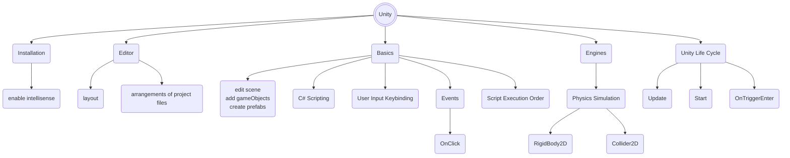

import ImageCard from '@site/src/components/ImageCard';
import Tabs from '@theme/Tabs';
import TabItem from '@theme/TabItem';

# Syllabus

The contents of these labs are made to teach and stress some learning points and for mere “practice”, e.g: getting used to Unity layout, terminologies, etc.

By no means we claim that they are the best practice, in fact some of the ways may be convoluted and they won’t be done exactly this way by experienced coder but we can’t teach the “best practices” right away because it relies on many prior knowledge.

:::tip Be respectful
Experienced programmers: keep in mind that you too were once a _beginner_. You made mistakes, you grow from it. You didn't get to be where you are right now instantly.

If you realise that some parts are troublesome or ineffective, then good for you. It means that you’re **experienced**, and from now on you can embark on the journey to customize it to a more fitting way: simpler, better, more efficient, whatever it is.

You can tell our teaching team your personal opinion, and constructive criticism is always welcome after class. We however expect a certain kind of mutual respect during the lab hours.
:::

We do not give a **trivial** hand-holding step-by-step tutorial here. We do condense some steps. Remember that this is still part of your graded lab assignment, so you need to **imply** some parts based on standard programming knowledge as a CS student.

### Week 1: Unity for Newborns

We start from standard introductory knowledge about using Unity:

 

| Topic                  | Details                                                                                                   |
| ---------------------- | --------------------------------------------------------------------------------------------------------- |
| Installation           | `mono`, `dotnet`, configuring editor, enabling intellisense                                               |
| Unity Basics (files)   | Layout arrangements, windows, managing project files                                                      |
| Unity Basics (scene)   | Adding and editing a scene, add GameObject & elements, create prefabs, use Camera, binding keys for input |
| Unity Basics (scripts) | C# scripting basics, setting script execution order                                                       |
| Unity Engine           | Physics Engine: `Rigidbody2D`, `Collider2D`                                                               |
| UI Elements            | Canvas, Text, Button (Legacy), TextMeshPro                                                                |
| Unity Lifecycle        | Introduction, common callback functions: `Update()`, `Start()`, `OnTriggerEnter()`, among many others.    |
| Unity Events           | `onClick()` Button                                                                                        |
