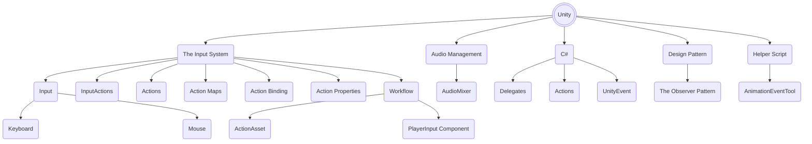
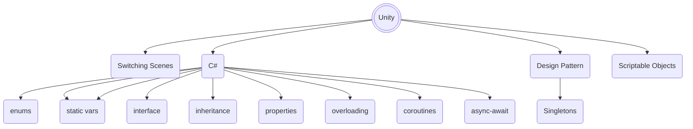

import ImageCard from '@site/src/components/ImageCard';
import Tabs from '@theme/Tabs';
import TabItem from '@theme/TabItem';

# Syllabus

The contents of these labs are made to teach and stress some learning points and for mere “practice”, e.g: getting used to Unity layout, terminologies, etc.

By no means we claim that they are the best practice, in fact some of the ways may be convoluted and they won’t be done exactly this way by experienced coder but we can’t teach the “best practices” right away because it relies on many prior knowledge.

:::tip Be respectful
Experienced programmers: keep in mind that you too were once a _beginner_. You made mistakes, you grow from it. You didn't get to be where you are right now instantly.

If you realise that some parts are troublesome or ineffective, then good for you. It means that you’re **experienced**, and from now on you can embark on the journey to customize it to a more fitting way: simpler, better, more efficient, whatever it is.

You can tell our teaching team your personal opinion, and constructive criticism is always welcome after class. We however expect a certain kind of mutual respect during the lab hours.
:::

We do not give a **trivial** hand-holding step-by-step tutorial here. We do condense some steps. Remember that this is still part of your graded lab assignment, so you need to **imply** some parts based on standard programming knowledge as a CS student.

### Week 1: Unity for Newborns

We start from standard introductory knowledge about using Unity:

 

| Topic                  | Details                                                                                                   |
| ---------------------- | --------------------------------------------------------------------------------------------------------- |
| Installation           | `mono`, `dotnet`, configuring editor, enabling intellisense                                               |
| Unity Basics (files)   | Layout arrangements, windows, managing project files                                                      |
| Unity Basics (scene)   | Adding and editing a scene, add GameObject & elements, create prefabs, use Camera, binding keys for input |
| Unity Basics (scripts) | C# scripting basics, setting script execution order                                                       |
| Unity Engine           | Physics Engine: `Rigidbody2D`, `Collider2D`                                                               |
| UI Elements            | Canvas, Text, Button (Legacy), TextMeshPro                                                                |
| Unity Lifecycle        | Introduction, common callback functions: `Update()`, `Start()`, `OnTriggerEnter()`, among many others.    |
| Unity Events           | `onClick()` Button                                                                                        |

### Week 2: Unity for Babies

This week, we expand our horizon a little bit and instill more fun in our lab by adding enhanced feedback:

 

| Topic                 | Details                                                                                                                             |
| --------------------- | ----------------------------------------------------------------------------------------------------------------------------------- |
| Animation             | Create animator and animation clips, transition between animations, setup animation parameters, timing animations and state machine |
| Unity Basics (camera) | Camera Movement                                                                                                                     |
| Unity Events          | Trigger events from animation                                                                                                       |
| Sound Effects         | Add sound effects                                                                                                                   |
| Unity Basics (files)  | Create and manage Prefabs                                                                                                           |

### Week 3: Unity for Toddlers

We have a lot of state management to do at this stage. It's time to learn more advanced Input Management, Audio Management, and Design Patterns.

 

| Topic                     | Details                                                              |
| ------------------------- | -------------------------------------------------------------------- |
| Unity                     | The Input System                                                     |
| The Input System Input    | Keyboard, Mouse                                                      |
| The Input System          | InputActions, Actions, ActionMaps, Action Binding, Action Properties |
| The Input System Workflow | ActionAsset, PlayerInput Component                                   |
| Unity                     | AudioMixer                                                           |
| Design Pattern            | The Observer Pattern                                                 |
| C#                        | Delegates, Actions, and UnityEvent                                   |
| Unity Scripting           | AnimationEvent\<T\>Tool                                              |

### Week 4: Unity for Children

This week we learn how to make multi-scene game and make important instances and values persist between scenes and gameplay.

 

| Topic           | Details                                                                                                  |
| --------------- | -------------------------------------------------------------------------------------------------------- |
| Unity           | Switching Scenes                                                                                         |
| C#              | Enums, switch statements, interface and inheritance, static variables, properties and method overloading |
| C# Advanced     | Coroutines, async-await                                                                                  |
| Design Pattern  | Singletons                                                                                               |
| Design Pattern  | Delegates, Actions, and Unity Events                                                                     |
| Unity Scripting | Scriptable Objects                                                                                       |
