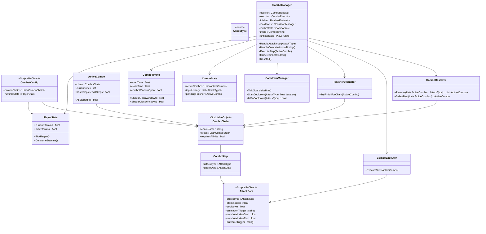
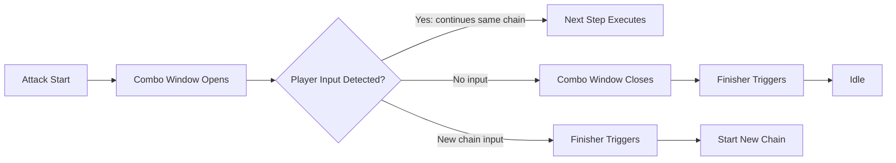
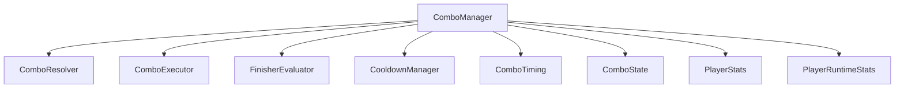
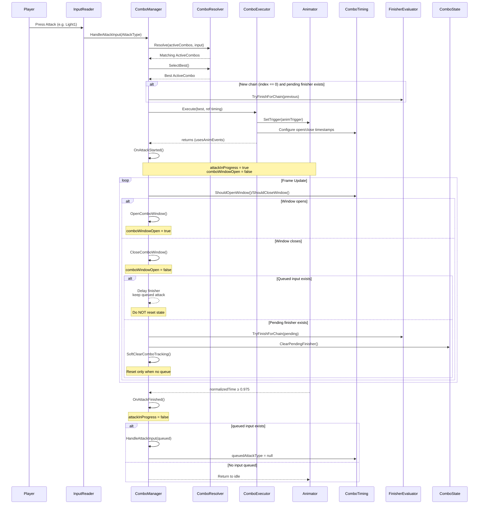

import Tabs from '@theme/Tabs';
import TabItem from '@theme/TabItem';
import CollapsibleAnswer from '@site/src/components/CollapsibleAnswer';
import DeepDive from '@site/src/components/DeepDive';
import ImageCard from '@site/src/components/ImageCard';
import ChatBaseBubble from "@site/src/components/ChatBaseBubble";
import VideoItem from '@site/src/components/VideoItem';

# Combo System

Modern action games use combo systems to transform simple button presses into expressive and skillful combat sequences. These systems define how attacks **connect**, how player inputs are interpreted, and how timing affects **responsiveness**. Over the years, developers have explored many different philosophies for designing combos, each shaping the rhythm and style of combat in distinctive ways.

In games like _God of War_ or _Nier: Automata_, combos are typically built around a <span class="orange-bold">chain</span>-based structure. Each button press leads naturally to the next animation, forming a rhythmic sequence that feels powerful and cinematic. These systems prioritize accessibility and flow. The player doesn’t need to memorize complex inputs, only to sense the right timing. In contrast, games such as _Devil May Cry_ or _Bayonetta_ elevate player expression by allowing <span class="orange-bold">cancels and branching</span> patterns. Attacks can be interrupted mid-animation or chained into other moves depending on frame timing, producing a fluid, improvisational style that rewards mechanical mastery.

**Competitive** fighting games like _Street Fighter_ or _Tekken_ take a different approach: combos there are <span class="orange-bold">input-pattern-driven</span>. The focus is on precision and memorization, where every motion and button press sequence must be executed with near-perfect timing **to link attacks successfully**. Meanwhile, tactical action titles like _Monster Hunter_ or _Nioh_ integrate stance-based or weapon-specific combos, where each weapon has its own rules and timing rhythm. In these games, combos are _slower_ but highly deliberate. Success depends on managing stamina, distance, and commitment.

The combo system implemented here takes inspiration from several of these design philosophies.

- Structurally, it resembles _God of War_’s readable **chain-based approach**, but internally, it is built to support **flexible branching and timing rules** more akin to _Bayonetta_ or _Devil May Cry_.
- It is **data-driven**, meaning designers define attacks, chains, and timings entirely through `ScriptableObjects` rather than code.
  The system dynamically interprets player input in real time, matching button sequences against a library of combo patterns and deciding whether to start a new chain, advance an existing one, or trigger a finisher.

:::note The System's Philosophy
This proposed approach creates a clear separation between **data** and **logic**.

Each combo is a piece of data: a configuration of steps, windows, and animation triggers—while the runtime system handles resolution, timing, and feedback. The result is a modular and scalable design where new weapons or fighting styles can be added without modifying code, only by creating new data assets. In practice, this allows the same engine to support everything from a simple three-hit sword combo to a complex branching martial arts system.
:::

### Prerequisite

This system relies on [Data-Driven Player Stats architecture](/resources/general/data-driven-stats).

## Architecture Overview

A combo system may appear simple: “press attack three times to chain hits” but under the hood, it’s an intricate network of _timing_, _state_, and data _interpretation_. The architecture here separates those concerns cleanly so that combat logic remains readable, extensible, and designer-friendly (can be tuned to improve feel via inspector without touching code).

At its core, this system follows a three-layer architecture:
| Layer | Purpose | Example Classes |
| ----------------- | ---------------------------------------------------------------------------------------- | ---------------------------------------------------------------------------------------- |
| **Data Layer** | Stores designer-defined information about attacks, stamina, and combo sequences. | `AttackData`, `ComboStep`, `ComboChain`, `CombatConfig` |
| **Runtime Layer** | Handles moment-to-moment logic: input processing, timing, animation, and execution. | `ComboManager`, `ComboExecutor`, `ComboResolver`, `CooldownManager`, `FinisherEvaluator` |
| **State Layer** | Tracks what’s currently happening such as active combos, queued attacks, current timing windows. | `ComboState`, `ComboTiming`, `ActiveCombo` |

Each layer interacts through well-defined data boundaries. The runtime <span class="orange-bold">never</span> directly <span class="orange-bold">hardcodes</span> what an attack does; it merely reads from the data layer and updates the state layer accordingly. This makes the entire combat system data-driven, testable, and non-destructive. We can iterate on weapon design without recompiling code.

### High Level Class Composition



Design Intent:

1. **No subclassing**: None of these types inherit from one another. Each one represents a distinct role in the combat pipeline.
2. **Single-responsibility**: Each class owns a single concept, such as resolution, execution, timing, etc. This means you can test them individually or replace implementations (e.g. swap ComboResolver for one that supports branching).
3. **Runtime composition**: The `ComboManager` instantiates and wires all of them. It doesn’t override behavior through inheritance; it <span class="orange-bold">delegates</span>.

It has the following composition hierarchy:

| Layer       | Owned By                   | Example Responsibilities                                                              |
| ----------- | -------------------------- | ------------------------------------------------------------------------------------- |
| **Data**    | Asset (ScriptableObject)   | Defines what attacks exist, how long windows last, stamina costs, animation triggers. |
| **State**   | `ComboManager` instance    | Tracks what is happening right now — active combos, pending finishers, timing.        |
| **Runtime** | `ComboManager` composition | Executes logic, updates state, reads data, and signals animations.                    |

### Sample Combat Moveset and Combo

In order to understand how things work in an abstract level, we need to use an example. Assume we have these clips and their `AttackType` values:

| Clip Name                    | Attack Type (key specific) | Description                              |
| ---------------------------- | -------------------------- | ---------------------------------------- |
| `Sword_Light1` (basic)       | `Light1`                   | First fast horizontal slash              |
| `Sword_Light2` (basic)       | `Light2`                   | Second faster returning slash            |
| `Sword_Light3` (basic)       | `Light3`                   | Third downward secondary slash           |
| `Sword_Light3_Ice` (special) | `Light3`                   | Downward secondary slash with Ice effect |
| `Sword_Heavy1` (basic)       | `Heavy`                    | A slower, stamina-heavy overhead strike  |
| `FireSlash_Finisher`         | --                         | Finisher animation for FireSlash Combo   |
| `GroundSlam_Finisher`        | --                         | Finisher animation for Groundslam Combo  |

Then, suppose we have these combo chains (the clips played are the basic ones unless otherwise stated):

- **FireSlash**: `Light1` → `Light2` (has finisher, hits not required)
- **IceSlash**: `Light1` → `Light2` → `Light3` (no finisher)
- **GroundSlam**: `Light1` → `Light1` → `Light2` → `Light3` → `Light1` (has finisher, all hits required)
- **Single tap**: Any one-step opener (e.g., just `Light1`) should also perform a valid attack (basic clip).

A combo sequence can look as simple as pressing a few buttons in rhythm but internally each press moves through a strict orchestration of logic, timing, and state updates.

Since certain key press like `Light3` in different chains might trigger different clips, we need to decompose the chains into Combo Steps (not just key presses)

#### FireSlash Combo Chain

**Description:** A short, 2-step chain that always triggers its finisher.
**Rule:** Finisher plays automatically after the second step; intermediate hits not required.

| Step | Attack Type | Clip Played          | Notes                                   |
| ---- | ----------- | -------------------- | --------------------------------------- |
| 1    | `Light1`    | `Sword_Light1`       | Opener horizontal slash                 |
| 2    | `Light2`    | `Sword_Light2`       | Returning slash; triggers Fire finisher |
| F    | _(auto)_    | `FireSlash_Finisher` | Finisher animation after step 2         |

#### IceSlash Combo Chain

**Description:** A 3-step sequence ending with an ice-enhanced downward strike.
**Rule:** No finisher; each hit must connect to progress.

| Step | Attack Type | Clip Played        | Notes                                          |
| ---- | ----------- | ------------------ | ---------------------------------------------- |
| 1    | `Light1`    | `Sword_Light1`     | Basic horizontal opener                        |
| 2    | `Light2`    | `Sword_Light2`     | Follow-up returning slash                      |
| 3    | `Light3`    | `Sword_Light3_Ice` | Downward ice effect strike (variant of Light3) |

---

#### GroundSlam Combo Chain

**Description:** A demanding 5-step chain with all hits required; ends in a heavy slam finisher.
**Rule:** Finisher only triggers if every hit connects.

| Step | Attack Type | Clip Played           | Notes                                  |
| ---- | ----------- | --------------------- | -------------------------------------- |
| 1    | `Light1`    | `Sword_Light1`        | Horizontal opener                      |
| 2    | `Light1`    | `Sword_Light1`        | Repeated opening slash                 |
| 3    | `Light2`    | `Sword_Light2`        | Mid combo returning slash              |
| 4    | `Light3`    | `Sword_Light3`        | Downward secondary slash               |
| 5    | `Light1`    | `Sword_Light1`        | Final connecting slash before finisher |
| F    | _(auto)_    | `GroundSlam_Finisher` | Finisher only if all 5 hits succeeded  |

#### Single Tap (Fallback Chain)

**Description:** Default chain for any isolated key press.
**Rule:** A single-step combo that always resolves successfully the moment that Attack Type key is pressed.

| Step | Attack Type | Clip Played    | Notes                                |
| ---- | ----------- | -------------- | ------------------------------------ |
| 1a   | `Light1`    | `Sword_Light1` | Basic slash                          |
| 1b   | `Light2`    | `Sword_Light2` | Optional single second slash variant |
| 1c   | `Heavy`     | `Sword_Heavy1` | Heavy strike variant                 |

:::note Combo Step and Combo Chain
A Combo Step defines the attack data: clip to play, key press to trigger, and combo window. A Combo Chain is made of several combo steps in succession.
:::

### The Big Picture: Resolving and Executing Combos

#### Step 1: Player Input

A button press (`Light1`, `Heavy`, etc.) is captured and passed to `ComboManager`.
Input is read using [Unity’s Input System](/docs/toddlers/management).

#### Step 2: Combo Resolution

`ComboResolver` checks _all_ known combo chains and decides whether this input:

- **Starts** a new combo (if no active one exists or the input matches a new opener), or
- **Advances** an existing combo if it matches the expected next step.

If several chains share the same prefix (all begin with `Light1`), they are <span class="orange-bold">all</span> temporarily active until later inputs disambiguate.

The resolver should also compute the _best_ chain so that only one combo step executes at a time: the completed chain is **chosen** when multiple are valid. If no chain is completed, then it will select the **longest** chain instead.

For example, suppose we received `Light1`. This tracks all three chains: FireSlash, IceSlash, and GroundSlam. Then `Light2` is pressed. The resolver computes that:

- `Light1 → Light2` **continues** the **FireSlash** chain (incomplete).
- `Light1 → Light2` also **continues** toward **IceSlash** chain (incomplete).
- However it no longer tracks the **GroundSlam**.
- Creates new single-tap combo `Light2` (instantly completed)

At this point, the **best** chain would be `Light2` (single-tap combo chain).

#### Step 3: Execution

`ComboExecutor` **triggers** the animation clip for the current (_best_) step, **consumes** stamina, **applies** cooldowns, and **determines** the next combo-window timing from either animation events or ratio settings.

#### Step 4: Combo Timing Control

`ComboTiming` <span class="orange-bold">stores</span> the `open` and `close` combo timestamps for the next input window, allowing the player to _chain smoothly_.

- It never triggers events itself; it only exposes
  `ShouldOpenWindow()` / `ShouldCloseWindow()` predicates that the `ComboManager` polls every frame.
- <span class="red-bold">Important:</span> each move’s animation clip must be **longer than its combo window**, so the system has time to open the window mid-animation before closing it near the end.

If the player presses the next attack **inside** the open window, the all active combo chains **advances**.

If pressed **too early or too late**, the manager either **buffers** one queued input or **drops** it once the window expires.

#### Step 5: State Update

We need to store some kind of `ComboState` that holds the **global** runtime context—active chains, input history, and the currently playing combo. Therefore, once we decide the execute a combo and set up all the timings (animation clip window and combo window), we need to update our `ComboState`.

Recall that if several combos chains are active (e.g., `FireSlash` and `IceSlash` after `Light2`), the system keeps both but executes whichever has the **deepest** progress or is already **complete**.

#### Step 6: Finisher Check

Finishers mark the completion point of a combo chain. When a chain reaches its final step, the system arms its finisher, but doesn’t play it right away.

Instead, the finisher is triggered _contextually_, depending on what happens next:

1. If the player stops input, then the finisher plays naturally as the combo concludes.
2. If the next input starts a new chain (for example, pressing `Light3` after completing `Light1` → `Light2`) then the system first plays the previous combo’s finisher, then begins the _new_ chain.
3. If the next input continues the same combo (e.g. `Light1` → `Light2` → `Light3` in a longer chain), then the finisher is suppressed until that longer sequence finishes.

This ensures short combos still deliver their finishing payoff, while longer or branching chains remain smooth and uninterrupted. The result is a combat flow that feels responsive, readable, and cinematic as finishers punctuate the action only when a combo truly ends.

:::note
If we want to add damage computation logic (AOE hits, explosions, shockwaves, etc.) for certain finishers,
the clean and scalable way is to attach that behaviour to the animation clip via events, not to the combo logic itself.
:::

#### Step 7: Return to Idle

If no input is queued when the animation ends, the combo state is cleared and the system returns to idle, ready for a fresh sequence.

### Timing Example

Timing determines whether an input continues a combo or fails to register.

Even a perfectly defined chain (`Light1 → Light2 → Light3`) will not feel responsive unless its combo windows line up naturally with animation playback.

#### 1. Anatomy of a Combo Step

Each attack animation (e.g. `Light1`) has two critical regions:

```
|--------------- Animation Clip (0.0 → 1.0 normalized) ---------------|
^ Start: Attack Triggered                                             |
|              ^ Combo Window Opens                                   |
|                                                           ^ Combo Window Closes
|                                                                     ^ Animation Ends
```

- The **animation clip** represents the full motion of a single attack.
- The **combo window** is a time slice within that motion where the next input is allowed.
- The **manager** uses the window timestamps (start / end) stored in `ComboTiming` to decide when to accept chaining.

<span class="orange-bold">Example:</span>
If the clip is 1.0 s long and the window starts at 0.45 s and ends at 0.80 s, then:

- Pressing the _next_ input between **0.45 s–0.80 s** <span class="orange-bold">continues</span> the combo.
- Pressing before 0.45 s buffers one input (queued).
- Pressing after 0.80 s is ignored (the window closed).

#### 2. Animation Length vs Combo Window

It is assumed that the **animation clip length must always be longer than the combo window** for that step.
This ensures the window opens **while** the move is still visible and playable.

```
Correct:
|---------------------- Clip (1.0s) ----------------------|
         |------ Combo Window (0.45–0.80s) ------|

Incorrect:
|----- Clip (0.5s) -----|
      |------ Combo Window (0.45–0.80s) ------| exceeds clip length
```

:::info Designer Tips
When designing new moves, always adjust the window so that it fits comfortably _within_ the visible attack animation.
If the window opens too early or closes too late, the system will either never open it or fail to chain correctly.
:::

#### 3. Example Timeline: `Light 1` → `Light 2` → `Light 3` (“IceSlash”)

:::note Combo Chain: IceSlash
This combo chain is consisted of 3 combo steps:

- Step 1: Light1 input, Sword_Light1 clip
- Step 2: Light2 input, Sword_Light2 clip
- Step 3: Light3 input, Sword_Light3_Ice clip

:::

```text
Time (s)   0.0      0.4      0.8     1.2     1.6     2.0
        |--------|---------|-------|-------|-------|
         ⮕ Input: Light1 accepted
Light1   ▶ [Animation Sword_Light1]
              [⏲ Combo Window]
                        ⮕ Input: Light2 accepted
Light2                             ▶ [Animation Sword_Light2]
                                        [⏲ Combo Window]
                                             ⮕ Input: Light3 accepted
Light3                                                       ▶ [Animation Sword_Light3_Ice]
                                                                    [⏲ Combo Window]
                                                                                            ⮕ Finisher triggered if any (after Light 3 animation ends)
```

:::note
Each animation plays <span class="orange-bold">fully</span>, with its own embedded window.
:::

The player presses at the rhythm of the combo window opening. If any input misses its combo window, the chain breaks and the manager resets state.

#### 4. Multiple Active Chains & “Longest Match” vs “Completed”

During execution, several combos can remain active at once. For example, after pressing `Light2`, both `FireSlash` and `IceSlash` may still be valid continuations.

The resolver keeps <span class="orange-bold">all</span> active possibilities alive until input or timing disambiguates them. When the next input arrives, or when the current combo window closes, it determines the **best chain** to advance or finish.

Priority follows two rules:

1. **If a chain can still advance (combo window open):**
   Pick the chain with the **longest valid progress** (deepest index).
   This lets complex combos naturally override simpler ones that share prefixes.

2. **If the combo window closes (no further input can advance):**
   If one or more active chains have reached their **final step**, the system picks that chain and triggers its **finisher**.
   If no chain can continue, but a new input begins a _different_ chain (a new opener), then the **previous finished chain’s finisher** triggers _first_, immediately followed by the new chain’s opener.

This timing rule ensures finishers are not fired prematurely, only when the system is certain no more valid continuation exists for the current combo.

#### 5. Finisher Timing

A finisher is evaluated **when the combo window closes**, signalling that no further continuation is possible.

If the next input after this point starts a _new_ chain rather than extending the current one,
the finisher for the old chain plays **first**, and then the new opener executes.

This gives clean transitions and <span class="orange-bold">prevents</span> double-triggering.

#### 6. Visual Recap



<br/>
> **Design takeaway:**
> A finisher doesn’t just mark “combo completed”, it marks <span class="orange-bold">“combo no longer extendable.”</span> It’s only triggered once the system knows the current sequence has ended, either naturally or because the next input belongs to a new chain.

## System Composition and Code Structure

:::success Composition Over Inheritance
The goal here is not inheritance, but composition. Each subsystem performs one job, and the ComboManager composes them together at runtime. Composition over inheritance keeps logic modular, testable, and replaceable.

Each component is stateless or self-contained, and the manager owns them by refer
:::

## Foundation Layer: Data & Stateless Components

These are the basic data definitions and lightweight utilities. They contain **no logic** besides what’s necessary to store or expose information used by the runtime.

### `AttackType.cs`

```csharp title="AttackType.cs"
public enum AttackType
{
    Light1,
    Light2,
    Light3,
    Heavy,
    None
}
```

> Simple identifier for different attacks.
> Used across chains and runtime systems.

### `AttackData.cs`

```csharp title="AttackData.cs"
using UnityEngine;

/// <summary>
/// Defines reusable data for a single attack animation:
/// stamina cost, cooldown, animation triggers, and timing overrides.
/// </summary>
[CreateAssetMenu(fileName = "NewAttackData", menuName = "Combat/Attack Data")]
public class AttackData : ScriptableObject
{
    [Header("Animation Settings")]
    [Tooltip("Animator trigger that starts this attack")]
    public string animTrigger;
    [Tooltip("The clip used for this attack")]
    public AnimationClip clip;

    [Tooltip("Optional follow-up animation (e.g., finisher). Leave empty for normal attacks")]
    public string outcomeTrigger;

    [Header("Combat Stats")]
    [Tooltip("Stamina consumed when performing this attack")]
    public float staminaCost = 10f;

    [Tooltip("Delay before another attack can be triggered")]
    public float cooldown = 0.1f;


}

```

> Defines per-attack gameplay and animation parameters.
> [Animator FSM transitions](#preparing-the-animation-clip-and-setting-up-the-animator-fsm) must be designed to match this.
> Used by `ComboExecutor`.

This is an `AttackData` for Single Tap Light1 Combo Step:
<ImageCard path={require("/resources/general/images/combo/2025-10-09-16-42-07.png").default} widthPercentage="100%"/>

This is an `AttackData` for the second Combo Step in FireSlash Combo Chain (has finisher trigger):
<ImageCard path={require("/resources/general/images/combo/2025-10-10-10-08-05.png").default} widthPercentage="100%"/>

This is an `AttackData` for the third Combo Step in IceSlash Combo Chain:
<ImageCard path={require("/resources/general/images/combo/2025-10-10-10-08-22.png").default} widthPercentage="100%"/>

### `ComboStep.cs`

```csharp title="ComboStep.cs"
using System.Collections.Generic;
using UnityEngine;

/// <summary>
/// Represents one step in the combo chain
/// </summary>
[System.Serializable]
public class ComboStep
{
    [Tooltip("The button pressed to trigger this step.")]
    public AttackType attackType;

    [Tooltip("Attack properties: stamina, animation, timing, etc.")]
    public AttackData attackData;

    [Header("Combo Window (optional override)")]
    [Tooltip("If true, uses these values instead of animation events")]
    public bool useWindowOverride = false;

    [Range(0f, 1f)] public float comboWindowStart = 0.45f;
    [Range(0f, 1f)] public float comboWindowEnd = 0.85f;
}

```

> Represents a single node in a combo chain.
> A `ComboChain` is simply an ordered list of `ComboStep`.

### `ComboChain.cs`

```csharp title="ComboChain.cs"
using System.Collections.Generic;
using UnityEngine;

/// <summary>
/// Collection of combo steps that form a complete combo tree for a weapon or stance.
/// </summary>
[CreateAssetMenu(fileName = "NewComboChain", menuName = "Combat/Combo Chain")]
public class ComboChain : ScriptableObject
{
    [Tooltip("If true, finisher requires every previous attack in this chain to land a hit.")]

    public string chainName;
    public bool requiresAllHits = false;
    public List<ComboStep> steps = new();

}

```

> A `ScriptableObject` defining a full combo pattern (e.g., `Light1 → Light2 → Light3`).
> Designers can author multiple chains per weapon.

<ImageCard path={require("/resources/general/images/combo/2025-10-09-16-42-49.png").default} widthPercentage="100%"/>

### `CombatConfig.cs`

```csharp title="CombatConfig.cs"
using UnityEngine;

[CreateAssetMenu(menuName = "Combat/Config/Combat Config")]
public class CombatConfig : ScriptableObject
{


    [Tooltip("Global stamina cost multiplier applied to all ComboSteps.")]
    public float staminaCostMultiplier = 1.0f;


    [Header("Combo Window Defaults")]
    [Range(0f, 1f)] public float defaultComboWindowStart = 0.5f;
    [Range(0f, 1f)] public float defaultComboWindowEnd = 0.8f;
}

```

> Bundles all combo chains and stats into one configuration per weapon or character.
> Referenced by `ComboManager` on startup.

### `PlayerStats.cs`

```csharp title="PlayerStats.cs"
using UnityEngine;

[CreateAssetMenu(menuName = "Player/Stats/Player Stats")]
public class PlayerStats : ScriptableObject
{
    [Header("Core")]
    public float maxStamina = 100f;
    public float staminaRegenRate = 10f;
    public float staminaRegenDelay = 1f;

    [Header("Health")]
    public float maxHealth = 100f;
}

```

> Static, fixed starting stats for Player object in the system. It is <span class="red-bold">not runtime stats</span>.

<ImageCard path={require("/resources/general/images/combo/2025-10-09-16-47-53.png").default} widthPercentage="100%"/>

### `CooldownManager.cs`

```csharp title="CooldownManager.cs"
using System.Collections.Generic;
using System.Linq;

public class CooldownManager
{
    private readonly Dictionary<AttackType, float> timers = new();

    public void Tick(float dt)
    {
        foreach (var key in timers.Keys.ToList())
        {
            timers[key] -= dt;
            if (timers[key] <= 0f) timers.Remove(key);
        }
    }

    public bool IsOnCooldown(AttackType type, out float remaining) =>
        timers.TryGetValue(type, out remaining);

    public void Set(AttackType type, float duration)
    {
        if (duration > 0f) timers[type] = duration;
    }

    public void Clear() => timers.Clear();
}

```

> Tracks and updates cooldowns per attack.
> Queried in `ComboManager` before executing a step.

### `ComboTiming.cs`

```csharp title="ComboTiming.cs"
[System.Serializable]
public struct ComboTiming
{
    // ---------------------------
    // Core timing flags
    // ---------------------------
    public bool manualTimingControlActive; // true if using manual window timing
    public bool comboWindowOpen;           // true while player can chain attacks
    public bool attackInProgress;          // true while attack animation is active
    public AttackType? queuedAttackType;   // one buffered attack type, if any

    // ---------------------------
    // Combo window tracking
    // ---------------------------
    private float windowStartTime;
    private float windowEndTime;

    // ---------------------------
    // Semantic helpers
    // ---------------------------
    public bool HasQueue => queuedAttackType != null;
    public bool IsIdle => !attackInProgress && queuedAttackType == null;

    // ---------------------------
    // Methods
    // ---------------------------

    public void Reset(bool includeQueue = false)
    {
        manualTimingControlActive = false;
        comboWindowOpen = false;
        attackInProgress = false;
        if (includeQueue)
            queuedAttackType = null;
    }

    public void SetComboWindow(float start, float end)
    {
        windowStartTime = start;
        windowEndTime = end;
        manualTimingControlActive = true;
        comboWindowOpen = false;
    }

    public bool ShouldOpenWindow(float now) =>
        manualTimingControlActive && !comboWindowOpen && now >= windowStartTime;

    public bool ShouldCloseWindow(float now) =>
        manualTimingControlActive && comboWindowOpen && now >= windowEndTime;

    public void ClearWindow()
    {
        manualTimingControlActive = false;
        comboWindowOpen = false;
        windowStartTime = 0f;
        windowEndTime = 0f;
    }
}

```

> Holds the open/close timing for chaining combo inputs and <span class="orange-bold">queued attack buffer</span> (1 queue slot only).
> Polled by the manager each frame; never triggers events on its own.

### `ActiveCombo.cs`

```csharp title="ActiveCombo.cs"


using System.Collections.Generic;
using System.Linq;
using System.Text;

/// <summary>
/// Runtime tracker for an active combo chain.
/// </summary>
public class ActiveCombo
{
    public ComboChain chain { get; private set; }
    public bool hasCompletedAllSteps { get; private set; }

    private List<bool> stepHits;
    private int _currentIndex;
    public int currentIndex
    {
        get => _currentIndex;
        set
        {
            _currentIndex = value;
            TrySetComboCompletion();
        }
    }

    public ComboStep currentStep
    {
        get
        {
            return chain.steps[currentIndex];
        }
    }

    public AttackType currentAttackType
    {
        get
        {
            return currentStep.attackType;
        }
    }

    public ActiveCombo(ComboChain c, int startIndex = 0)
    {
        chain = c;
        currentIndex = startIndex;
        stepHits = Enumerable.Repeat(false, chain.steps.Count).ToList();
    }

    private void TrySetComboCompletion()
    {
        hasCompletedAllSteps = _currentIndex >= chain.steps.Count - 1;
    }

    public void RegisterHit()
    {
        stepHits[_currentIndex] = true;
    }

    public bool AllStepsHit()
    {
        return stepHits.All(hit => hit);
    }


    public void DebugPrintHits()
    {
        var sb = new StringBuilder();
        sb.AppendLine($"[ActiveCombo Debug] Chain: {chain.name} (Steps: {chain.steps.Count})");
        for (int i = 0; i < stepHits.Count; i++)
        {
            string status = stepHits[i] ? "✅ HIT" : "❌ MISS";
            string currentMarker = (i == currentIndex) ? " <-- current" : "";
            sb.AppendLine($"  Step {i + 1}: {chain.steps[i].attackType}  [{status}]{currentMarker}");
        }
        sb.AppendLine($"All steps hit: {AllStepsHit()}");
        sb.AppendLine($"Has completed all steps: {hasCompletedAllSteps}");
        UnityEngine.Debug.Log(sb.ToString());
    }

}
```

> Tracks runtime progress through a single combo chain:
> current step, hits, and completion status.

## State Layer

### `ComboState.cs`

The **ComboState** is the runtime data container that holds everything the combo system knows about the _current_ combat situation.
It’s never responsible for gameplay logic or animation, but only for **remembering state** between frames and inputs.

```csharp title="ComboState.cs"
using System.Collections.Generic;
#nullable enable
[System.Serializable]
public class ComboState
{
    public List<AttackType> inputHistory { get; set; } = new();
    public List<ActiveCombo> activeCombos { get; set; } = new();
    public ActiveCombo? currentActiveChain { get; set; }
    public ActiveCombo? pendingFinisher { get; private set; }


    public bool hasActive => activeCombos.Count > 0;
    public bool hasCompletedAllSteps => currentActiveChain != null && currentActiveChain.hasCompletedAllSteps;
    public bool canLaunchFinisher => currentActiveChain != null && (!currentActiveChain.chain.requiresAllHits || currentActiveChain.AllStepsHit());
    public void SetPendingFinisher(ActiveCombo combo) => pendingFinisher = combo;
    public void ClearPendingFinisher() => pendingFinisher = null;

    public void ClearTracking()
    {
        inputHistory.Clear();
        activeCombos.Clear();
        pendingFinisher = null;
    }

    public void ClearAll()
    {
        ClearTracking();
        currentActiveChain = null;
    }


}

```

This table summarizes its conceptual role:

| Category              | Description                                                                                                                                       |
| --------------------- | ------------------------------------------------------------------------------------------------------------------------------------------------- |
| **Purpose**           | Holds transient runtime data such as input history, active combo chains, and current progression.                                                 |
| **Ownership**         | Only the `ComboManager` writes to it; other systems (UI, analytics, VFX) can read from it.                                                        |
| **Persistence**       | It’s serializable for debugging and playtesting, but never saved between sessions.                                                                |
| **Pending Finishers** | Stores deferred finishers if a combo just ended but the system needs to wait before triggering it (e.g., player started a new chain immediately). |

With this, we can keep the **manager stateless** since it just manipulates `ComboState`. It makes debugging straightforward and allows new runtime tools (e.g. “combo replay visualizer” or analytics) without touching the core logic.

Perfect — here’s how to document and present **`ComboTiming`**, the second pillar of your _State Layer_.
It’s short and important — it gives the combo system its sense of _tempo_.

### `ComboTiming`

The **ComboTiming** class represents the **temporal state** of the combo system. It tracks when combo windows **open** and **close**, and exposes simple predicates to help the `ComboManager` decide when chaining is allowed.

It never plays animations or checks inputs directly; it only holds timestamps.

```csharp title="ComboTiming.cs"
[System.Serializable]
public class ComboTiming
{
    // ---------------------------
    // Core timing flags
    // ---------------------------
    public bool manualTimingControlActive; // true if using manual window timing
    public bool comboWindowOpen;           // true while player can chain attacks
    public bool attackInProgress;          // true while attack animation is active
    public AttackType? queuedAttackType;   // one buffered attack type, if any

    // ---------------------------
    // Combo window tracking
    // ---------------------------
    private float windowStartTime;
    private float windowEndTime;

    // ---------------------------
    // Semantic helpers
    // ---------------------------
    public bool HasQueue => queuedAttackType != null;
    public bool IsIdle => !attackInProgress && queuedAttackType == null;

    // ---------------------------
    // Methods
    // ---------------------------

    public void Reset(bool includeQueue = false)
    {
        manualTimingControlActive = false;
        comboWindowOpen = false;
        attackInProgress = false;
        if (includeQueue)
            queuedAttackType = null;
    }

    public void SetComboWindow(float start, float end)
    {
        windowStartTime = start;
        windowEndTime = end;
        manualTimingControlActive = true;
        comboWindowOpen = false;
    }

    public bool ShouldOpenWindow(float now) =>
        manualTimingControlActive && !comboWindowOpen && now >= windowStartTime;

    public bool ShouldCloseWindow(float now) =>
        manualTimingControlActive && comboWindowOpen && now >= windowEndTime;

    public void ClearWindow()
    {
        manualTimingControlActive = false;
        comboWindowOpen = false;
        windowStartTime = 0f;
        windowEndTime = 0f;
    }
}

```

The table below summarises its conceptual role:

| Category            | Description                                                                              |
| ------------------- | ---------------------------------------------------------------------------------------- |
| **Purpose**         | Defines the timing boundaries (`openTime`, `closeTime`) of the combo input window.       |
| **Responsibility**  | Only knows _when_ events happen — never triggers them itself.                            |
| **Used by**         | `ComboManager` (which polls `ShouldOpenWindow()` and `ShouldCloseWindow()` every frame). |
| **Stateful Fields** | Tracks queued input (buffered attack) and recovery phase between moves.                  |

`ComboTiming` acts as a **stopwatch**, not a conductor. It simply keeps track of time and the `ComboManager` decides what to do when that time runs out.

## Logic Layer

### `ComboResolver.cs`

The resolver is the **decision-maker** of the system.
It takes the current active combos, the new input, and determines:

1. Which chains can advance.
2. Which new chains should start.
3. Which one is the **best** to execute right now.

It never plays animations or handles stamina. It just performs **data matching**.

```csharp title="ComboResolver.cs"
using System.Collections.Generic;
using System.Linq;
#nullable enable
/// <summary>
/// Determines which combos advance or start when a new input arrives.
/// </summary>
public class ComboResolver
{
    private readonly List<ComboChain> comboChains;
    private readonly System.Action<string, string>? log; // optional log hook

    public ComboResolver(List<ComboChain> comboChains, System.Action<string, string>? log = null)
    {
        this.comboChains = comboChains;
        this.log = log;
    }

    /// <summary>
    /// Given the current active combos and an input, returns the new set of active combos.
    /// May advance existing combos and/or start new ones.
    /// </summary>
    public List<ActiveCombo> Resolve(List<ActiveCombo> current, AttackType input)
    {
        var nextActive = new List<ActiveCombo>();
        int advanced = 0, started = 0;

        // Advance existing combos if the next step matches the input
        foreach (var combo in current)
        {
            int next = combo.currentIndex + 1;
            if (next < combo.chain.steps.Count &&
                combo.chain.steps[next].attackType == input)
            {
                combo.currentIndex = next;
                nextActive.Add(combo);
                advanced++;
                log?.Invoke(
                    $"Advanced combo <b>{combo.chain.chainName}</b> → step {next + 1}",
                    LogUtil.Color.Info
                );
            }
        }

        // Start new combos whose first step matches the input
        foreach (var chain in comboChains)
        {
            bool alreadyTracked = nextActive.Any(c => c.chain == chain);
            bool startsNew = !alreadyTracked &&
                             chain.steps.Count > 0 &&
                             chain.steps[0].attackType == input;

            if (startsNew)
            {
                var newCombo = new ActiveCombo(chain);
                nextActive.Add(newCombo);
                started++;
                log?.Invoke(
                    $"Started new combo <b>{chain.chainName}</b> (first step: {input})",
                    LogUtil.Color.Success
                );
            }
        }

        log?.Invoke(
            $"Resolved combos: {nextActive.Count} active ({advanced} advanced, {started} started)",
            LogUtil.Color.Info
        );

        return nextActive;
    }

    /// <summary>
    /// Chooses the best combo among currently active ones (deepest or completed first).
    /// </summary>
    public ActiveCombo? SelectBest(List<ActiveCombo> active)
    {
        if (active.Count == 0) return null;

        return active
            .OrderByDescending(c => c.hasCompletedAllSteps) // prefer finished chains
            .ThenByDescending(c => c.currentIndex)          // else deepest progress
            .FirstOrDefault();
    }
}

```

How `Resolve` works:

- **Advancement phase:**
  For each currently active combo, if the new input matches its next `ComboStep.attackType`, that combo advances.

- **Creation phase:**
  If the input matches the opener of a new combo chain, a new `ActiveCombo` is created.

- **Return phase**: returns a new list of active combos based on this input

It also offers a selection logic:

- Among all active combos, `SelectBest()` picks the one that either
- has completed all steps, or (if unavailable)
- has the deepest progress (`currentIndex`).

### `ComboExecutor.cs`

```csharp title="ComboExecutor.cs"
using UnityEngine;
#nullable enable
/// <summary>
/// Handles the execution of a single combo step:
/// plays animation, consumes stamina, applies cooldown,
/// and sets up combo timing.
/// </summary>
public class ComboExecutor
{
    private readonly Animator animator;
    private readonly PlayerRuntimeStats stats;
    private readonly CombatConfig config;
    private readonly CooldownManager cooldowns;
    private readonly int attackLayerIndex;
    private readonly System.Action<string, string>? log; // optional

    public ComboExecutor(
        Animator animator,
        PlayerRuntimeStats stats,
        CombatConfig config,
        CooldownManager cooldowns,
        int attackLayerIndex,
        System.Action<string, string>? log = null)
    {
        this.animator = animator;
        this.stats = stats;
        this.config = config;
        this.cooldowns = cooldowns;
        this.attackLayerIndex = attackLayerIndex;
        this.log = log;
    }

    /// <summary>
    /// Executes the provided combo step and configures timing.
    /// Returns true if this step uses animation events for combo window control.
    /// </summary>
    public bool Execute(ActiveCombo combo, ref ComboTiming timing)
    {
        var step = combo.currentStep;
        var data = step.attackData;
        var attackType = step.attackType;

        Log($"Execute {data.name}: {data.animTrigger} (stamina {data.staminaCost}, cooldown {data.cooldown:F2})", LogUtil.Color.Event);

        // trigger animation
        animator.SetTrigger(data.animTrigger);

        // apply stamina & cooldown
        stats.UseStamina(data.staminaCost * config.staminaCostMultiplier);
        cooldowns.Set(attackType, data.cooldown);

        // check animation events
        bool hasAnimEvents = HasComboEvents(data.animTrigger);
        if (hasAnimEvents)
        {
            Log($"Using animation-event combo windows for {data.clip.name}", LogUtil.Color.Event);
            return true;
        }

        // compute manual window
        float clipLength = GetClipLength(combo);
        if (clipLength <= 0f) clipLength = 0.5f;

        float startRatio, endRatio;
        if (step.useWindowOverride)
        {
            startRatio = step.comboWindowStart;
            endRatio = step.comboWindowEnd;
            Log($"Using AttackData Override window ({startRatio:F2}–{endRatio:F2})", LogUtil.Color.Event);
        }
        else
        {
            startRatio = config.defaultComboWindowStart;
            endRatio = config.defaultComboWindowEnd;
            Log($"Using CombatConfig Default window ({startRatio:F2}–{endRatio:F2})", LogUtil.Color.Event);
        }

        float start = Time.time + startRatio * clipLength;
        float end = Time.time + endRatio * clipLength;
        timing.SetComboWindow(start, end);
        return false;
    }

    // ------------------------------------------------------------------------
    // Helper Methods
    // ------------------------------------------------------------------------

    private void Log(string message, string color = "#FFFFFF")
    {
        log?.Invoke(message, color);
    }

    private bool HasComboEvents(string animName)
    {
        if (animator.runtimeAnimatorController == null) return false;

        foreach (var clip in animator.runtimeAnimatorController.animationClips)
        {
            if (clip.name != animName) continue;
            foreach (var evt in clip.events)
            {
                if (evt.functionName == nameof(ComboManager.OpenComboWindow) ||
                    evt.functionName == nameof(ComboManager.CloseComboWindow))
                    return true;
            }
        }
        return false;
    }

    private float GetClipLength(ActiveCombo combo)
    {
        var data = combo.currentStep.attackData;
        if (data?.clip == null) return 0.5f;

        float speed = animator != null ? animator.speed : 1f;
        return data.clip.length / Mathf.Max(speed, 0.0001f);
    }
}

```

The table below summarises its behavior:

| Step                 | Purpose                                              | Notes                              |
| -------------------- | ---------------------------------------------------- | ---------------------------------- |
| 1. Resource checks   | Ensures player has stamina and no cooldown conflict. | Cancels attack if failed.          |
| 2. Animation trigger | Fires the Animator trigger from `AttackData`.        | Decoupled from logic.              |
| 3. Cooldown setup    | Starts cooldown timer for this attack.               | Prevents immediate reuse.          |
| 4. Timing setup      | Defines open/close times for chaining.               | Used by `ComboManager` each frame. |

:::note
This class is Compositional because:

- **No awareness** of combos, branching, or finishers.
- **No dependency** on `ComboManager` — it’s just invoked by it.
- **Self-contained**: can be tested or reused by AI or cutscene logic.

:::

### Setting Combo Window Open and Close Timing

Right now there are three methods to do so: via Animation Event, via `ComboStep` window override or via global `CombatConfig` (order of decreasing priority).

#### Animation Events (Highest Priority)

In this method, each animation clip of that attack move (defined in `AttackData`) must have created two events that is connected to the callback: `ComboManager.OpenComboWindow` and `ComboManager.CloseComboWindow`. This way, `ComboManager` will <span class="orange-bold">not</span> manually keep track of the combo window time via `Update()` or call the Open/Close methods manually.

#### `ComboStep` Override

You can optionally set your own combo window (in terms of % of the clip length) for each Combat Step:

<ImageCard path={require("/resources/general/images/combo/2025-10-10-10-23-49.png").default} widthPercentage="100%"/>
ComboManager will manually call `Open/CloseComboWindow` methods and track combo window time via` Update()` with these values.

#### `CombatConfig` global value (Lowest Priority)

If you didn't set the Animation Events or set the override in the Combo Step, then the system will use the values in `CombatConfig`:

<ImageCard path={require("/resources/general/images/combo/2025-10-10-10-25-24.png").default} widthPercentage="100%"/>
ComboManager will also manually call `Open/CloseComboWindow` methods and track combo window time via` Update()` with these values.

### `FinisherEvaluator.cs`

The **FinisherEvaluator** is a lightweight component that decides _when and how_ to trigger a finisher animation.
It doesn’t contain combo resolution or timing logic as those are handled by `ComboManager` (later).
Its sole responsibility is to **translate a completed combo into a final animation trigger.**

```csharp title="FinisherEvaluator.cs"
using System;
using UnityEngine;
#nullable enable
public class FinisherEvaluator
{
    private readonly Animator animator;
    private readonly Action<string, string>? log;

    public FinisherEvaluator(Animator animator, Action<string, string>? log = null)
    {
        this.animator = animator;
        this.log = log;
    }
    public void TryFinishForChain(ActiveCombo combo)
    {
        var trigger = combo.currentStep.attackData?.outcomeTrigger;
        if (string.IsNullOrEmpty(trigger)) return;
        log?.Invoke($"[Finisher] Triggered for {combo.chain.chainName}: {trigger}", LogUtil.Color.Input);
        animator.SetTrigger(trigger);
    }

    public void TryFinish(ComboState state)
    {
        if (!state.hasCompletedAllSteps)
        {
            log?.Invoke("Finisher not available: combo not completed yet.", LogUtil.Color.Info);
            return;
        }
        if (!state.canLaunchFinisher)
        {
            state.currentActiveChain?.DebugPrintHits();
            log?.Invoke("Finisher blocked: not all hits landed.", LogUtil.Color.Info);
            return;
        }
        if (state.currentActiveChain == null) return;

        var chain = state.currentActiveChain.chain;

        var finalStep = state.currentActiveChain.currentStep;
        var trigger = finalStep.attackData?.outcomeTrigger;
        if (string.IsNullOrEmpty(trigger)) return;

        log?.Invoke($"Finisher triggered: {trigger}", LogUtil.Color.Input);
        animator.SetTrigger(trigger);
    }
}

```

The table below summarizes its key points:

| Responsibility          | Description                                                                         |
| ----------------------- | ----------------------------------------------------------------------------------- |
| **Trigger animation**   | Plays the `outcomeTrigger` from the final `AttackData` when a combo completes.      |
| **No timing logic**     | Called by `ComboManager` only when the combo can no longer continue.                |
| **Optional validation** | Can check for hit confirmation (`AllStepsHit()`) or chain completion before firing. |
| **Data-driven**         | Finisher type and animation are defined entirely in `AttackData`.                   |

## Runtime Layer: The Orchestrator `ComboManager`

In this architecture, the `ComboManager` is the <span class="orange-bold">orchestrator</span> and state machine that governs the rhythm of combat.

It controls _when_ the player can act, _when_ a combo window opens or closes, _when_ animations start or finish, and _when_ finishers are evaluated.

We can think of it as the conductor of a live orchestra: every subsystem (resolver, executor, evaluator, etc.) is an instrument, but the `ComboManager` cues them at the right moment.



<br/>

:::note Philosophy
The key insight is that the manager never “knows” what combo it’s executing. It in an _orchestrator_.
It simply interprets a pattern of inputs against a table of data and lets the data dictate the result.

The `ComboManager` also doesn’t contain gameplay logic, _it coordinates it_.

It <span class="orange-bold">delegates</span> to the `Resolver`, `Executor`, `CooldownManager` and `FinisherEvaluator` subsystems while holding no hardcoded knowledge about what specific combo or animation is being played.

This separation makes it compositional and testable and ensures designers can balance timing, stamina, or even entire combo trees without writing a single line of code.
:::

### `ComboManager.cs`

```cs title="ComboManager.cs"
using UnityEngine;
using UnityEngine.InputSystem;
using System.Collections;
using System.Collections.Generic;
using System.Linq;
using System.Data.Common;

/// <summary>
/// Handles input pattern matching, stamina usage, cooldowns, and combo timing.
/// Works with PlayerContext, PlayerRuntimeStats, ComboChain, and AttackDataSO.
/// Branch-aware sequential architecture: each ComboChain is ordered steps,
/// and multiple active combos may coexist when prefixes overlap.
/// </summary>
[RequireComponent(typeof(Animator))]
[RequireComponent(typeof(PlayerContext))]
public class ComboManager : MonoBehaviour
{
    //=====================================================================
    // CONFIGURATION
    //=====================================================================

    [Header("Combo Data")]
    public List<ComboChain> comboChains;

    [Header("Runtime References")]
    public Animator animator;
    public int AnimatorAttackLayerIndex = 1;

    [Header("Debug Settings")]
    public bool enableDebugLogs = true;


    //=====================================================================
    // RUNTIME CONTEXT & COMPONENT REFERENCES
    //=====================================================================

    private PlayerContext context;
    private PlayerRuntimeStats runtimeStats;
    private CombatConfig combatConfig;


    //=====================================================================
    // STATE TRACKING
    //=====================================================================

    private ComboState comboState = new();
    private CooldownManager cooldownManager = new();
    private ComboTiming timing;


    //=====================================================================
    // LOGIC COMPONENTS
    //=====================================================================

    private ComboResolver resolver;
    private ComboExecutor executor;
    private FinisherEvaluator finisher;
    //=====================================================================
    // METHODS
    //=====================================================================


    #region Setup & Lifecycle

    void Awake()
    {
        context = GetComponent<PlayerContext>();
        runtimeStats = context.runtimeStats;
        combatConfig = context.combatConfig;
        resolver = new ComboResolver(comboChains, LogCombo);
        executor = new ComboExecutor(animator, runtimeStats, combatConfig, cooldownManager, AnimatorAttackLayerIndex, LogCombo);
        finisher = new FinisherEvaluator(animator, LogCombo);
        LogCombo("Initialized ComboManager", LogUtil.Color.Debug);
    }

    void Start()
    {
        foreach (var chain in comboChains)
        {
            LogCombo($"[Init] Chain '{chain.chainName}' has {chain.steps.Count} steps:", LogUtil.Color.Info);
            for (int i = 0; i < chain.steps.Count; i++)
            {
                var step = chain.steps[i];
                string trigger = step.attackData != null ? step.attackData.animTrigger : "<null>";
                string patternSoFar = string.Join(", ", chain.steps
                    .Take(i + 1)
                    .Select(s => s.attackType.ToString()));

                LogCombo($"    Step {i + 1}: [{patternSoFar}] → {trigger}", LogUtil.Color.Info);
            }
        }
    }

    void Update()
    {
        runtimeStats.TickRegen(Time.deltaTime);
        cooldownManager.Tick(Time.deltaTime);
        HandleComboWindowTiming();
        LaunchQueuedAttack();
    }

    bool IsCurrentClipSameAs(Animator animator, AnimationClip targetClip)
    {
        if (targetClip == null)
            return false;


        var clips = animator.GetCurrentAnimatorClipInfo(AnimatorAttackLayerIndex);
        if (clips.Length > 0)
        {
            // Debug.Log($"Clip {clips[0].clip}");
            if (clips[0].clip == targetClip)
            {
                return true;
            }
        }

        return false;
    }


    private void LaunchQueuedAttack()
    {
        if (timing.attackInProgress && comboState.currentActiveChain != null)
        {
            if (IsCurrentClipSameAs(animator, comboState.currentActiveChain.currentStep.attackData.clip))
            {
                var state = animator.GetCurrentAnimatorStateInfo(1);
                // Debug.Log($"Current state normalised time: {state.normalizedTime}");
                if (state.normalizedTime >= 0.975f)
                {
                    // mark early finish flag at 97.5% to account for slight delay
                    OnAttackFinished();
                }
            }
        }
    }

    private void HandleComboWindowTiming()
    {
        if (!timing.manualTimingControlActive) return;
        float now = Time.time;
        if (timing.ShouldOpenWindow(now))
        {
            OpenComboWindow();
        }
        else if (timing.ShouldCloseWindow(now))
        {
            CloseComboWindow();
            timing.ClearWindow();
        }
    }


    #endregion

    #region Input Handling

    private bool CanAttack(AttackType attackType)
    {
        if (!runtimeStats.HasEnoughStamina(1f))
        {
            LogCombo("Not enough stamina to attack", LogUtil.Color.Error);
            return false;
        }

        if (cooldownManager.IsOnCooldown(attackType, out float remaining))
        {
            LogCombo($"[{attackType}] is still on cooldown: {remaining:F2}s remaining", LogUtil.Color.Error);
            LogCombo("Combo cancelled due to cooldown", LogUtil.Color.Info);
            SoftClearComboTracking(); // soft clear tracking, keep current chain
            return false;
        }

        return true;
    }

    public void HandleAttackInput(AttackType attackType)
    {
        LogCombo($"Input received: <b>{attackType}</b> while attack in progress: {timing.attackInProgress}", LogUtil.Color.Input);
        // early termination
        if (!CanAttack(attackType)) return;

        // If no attack in progress then resolve and execute immediately
        if (!timing.attackInProgress)
        {
            comboState.inputHistory.Add(attackType);
            comboState.activeCombos = resolver.Resolve(comboState.activeCombos, attackType);
            var best = resolver.SelectBest(comboState.activeCombos);

            if (best == null)
            {
                // if nothing advanced or started -> trigger pending finisher once this combo closes
                LogCombo($"Input {attackType} did not advance any chain; will finish pending finisher if any: {comboState.pendingFinisher.chain.chainName}", LogUtil.Color.Warning);
                return;
            }
            ;

            // check if this best is a new chain, if yes, trigger finisher now
            if (best.currentIndex == 0 && comboState.pendingFinisher != null)
            {
                finisher.TryFinishForChain(comboState.pendingFinisher);
            }

            // if not, it means something advanced, clear the pending finisher
            comboState.ClearPendingFinisher();

            var step = best.currentStep;
            LogCombo(
                $"{(best.hasCompletedAllSteps ? "Will complete" : "Will continue")} combo: " +
                $"<b>{best.chain.chainName}</b> | Step {best.currentIndex + 1}/{best.chain.steps.Count} | " +
                $"Attack: <b>{step.attackType}</b>",
                best.hasCompletedAllSteps ? LogUtil.Color.Success : LogUtil.Color.Highlight
            );

            ExecuteStep(best);
            return;
        }

        // otherwise add to queue
        // check if there's space
        if (timing.queuedAttackType == null)
        {
            LogCombo($"ADD queued attack: <b>{attackType}</b>", LogUtil.Color.Highlight);
            timing.queuedAttackType = attackType;
            // check if combo window is open
            if (timing.comboWindowOpen)
            {
                // we do nothing
                return;
            }
            LogCombo($"Window already closed, will reset combo state");
        }

        LogCombo($"REPLACE queued attack: <b>{attackType}</b>", LogUtil.Color.Highlight);
        // queue already full, we just replace it
        timing.queuedAttackType = attackType;
        SoftClearComboTracking(); // removes input history and activecombos but keeps currentActiveCombo


    }


    #endregion


    #region Execution
    private void ExecuteStep(ActiveCombo combo)
    {
        timing.ClearWindow();
        bool usesAnimEvents = executor.Execute(combo, ref timing);
        comboState.currentActiveChain = combo;
        OnAttackStarted();

        if (combo.hasCompletedAllSteps)
        {
            LogCombo($"[Pending Finisher loaded] {combo.chain.chainName} marked as finisher candidate", LogUtil.Color.Highlight);
            comboState.SetPendingFinisher(combo);
        }

        // if manual timing is used, executor already set windowStart/End inside timing
        if (!usesAnimEvents)
        {
            timing.manualTimingControlActive = true; //  explicitly re-arm timing
        }
    }


    #endregion


    #region Finisher Logic

    public void ConfirmHit()
    {
        if (comboState.currentActiveChain == null)
        {
            LogCombo("Hit confirmed, but no active attack step: ignored", LogUtil.Color.Warning);
            return;
        }

        LogCombo($"Hit confirmed during attack: {comboState.currentActiveChain.currentStep.attackData.name}", LogUtil.Color.Success);

        foreach (var combo in comboState.activeCombos)
        {
            if (combo.currentIndex < 0 || combo.currentIndex >= combo.chain.steps.Count)
                continue;


            combo.RegisterHit();
            combo.DebugPrintHits();
        }
    }
    public void OpenComboWindow()
    {
        timing.comboWindowOpen = true;
        LogCombo($"Window OPEN at {Time.time:F2}", LogUtil.Color.Highlight);
    }

    public void CloseComboWindow(bool fromComboFinish = false)
    {
        timing.comboWindowOpen = false;
        LogCombo($"Window CLOSE at {Time.time:F2}", LogUtil.Color.Highlight);

        // Don’t finish if something is queued
        if (timing.queuedAttackType != null)
        {
            LogCombo("Queued attack exists; delaying finisher", LogUtil.Color.Info);
            return;
        }

        // The right condition to fire here: no queue + pending finisher
        if (comboState.pendingFinisher != null)
        {
            LogCombo($"Triggering finisher: {comboState.pendingFinisher.chain.chainName}", LogUtil.Color.Success);
            finisher.TryFinishForChain(comboState.pendingFinisher);
            comboState.ClearPendingFinisher();
        }

        SoftClearComboTracking();
    }

    #endregion


    #region Reset & State Management
    // Clears lists but keeps current chain and current timing state (your old ResetComboState behavior)
    private void SoftClearComboTracking()
    {
        LogCombo("SoftClearComboTracking");
        comboState.ClearTracking();
    }


    public void OnAttackStarted()
    {
        timing.attackInProgress = true;
        timing.comboWindowOpen = false;
        LogCombo($"Attack Animation STARTED at {Time.time:F2} <color=#7FFFD4><b>ComboTiming @ {context}</b></color>\n{timing}", LogUtil.Color.Info);
    }

    public void OnAttackFinished()
    {
        if (!timing.attackInProgress) return;
        timing.attackInProgress = false;
        LogCombo($"Attack Animation FINISHED at at {Time.time:F2}");
        // Check for queued attack
        if (timing.queuedAttackType != null)
        {
            LogCombo($"Executing queued attack {timing.queuedAttackType}", LogUtil.Color.Success);
            HandleAttackInput(timing.queuedAttackType.Value);
            timing.queuedAttackType = null;
        }
        else
        {
            LogCombo("No queued attack found", LogUtil.Color.Info);
        }
    }

    #endregion

    #region Debug & Logging
    private void LogCombo(string message, string color = "#FFFFFF")
    {
        if (!enableDebugLogs) return;
        LogUtil.LogDebug(message, color, "ComboManager");
    }
    #endregion
}


```

### Unpacking the Manager

**Composition over inheritance**: as mentioned, `ComboManager` wires small, single-purpose modules and coordinates timing. It never hardcodes “what” a move does but <span class="orange-bold">only</span> “when” to advance, finish, or reset.

#### Collaborators (composition)

- **Data:** `ComboChain` (list), `CombatConfig` (via `PlayerContext`)
- **State:** `ComboState`, `ComboTiming`
- **Logic:** `ComboResolver`, `ComboExecutor`, `FinisherEvaluator`, `CooldownManager`
- **Engine:** `Animator` (attack layer index configurable)

#### Lifecycle & wiring

```csharp
void Awake() {
  context = GetComponent<PlayerContext>();
  runtimeStats = context.runtimeStats;
  combatConfig = context.combatConfig;

  resolver  = new ComboResolver(comboChains, LogCombo);
  executor  = new ComboExecutor(animator, runtimeStats, combatConfig, cooldownManager, AnimatorAttackLayerIndex, LogCombo);
  finisher  = new FinisherEvaluator(animator, LogCombo);

  timing    = new ComboTiming();
}
```

- **`Start()`**: logs each chain & step (great for authoring/debug).
- **`Update()`**: ticks stamina & cooldowns, polls timing, and checks clip completion (via `LaunchQueuedAttack()`).

#### Input path (no attack in progress)

```csharp
public void HandleAttackInput(AttackType atk) {
  if (!CanAttack(atk)) return;
  if (!timing.attackInProgress) {
    comboState.inputHistory.Add(atk);
    comboState.activeCombos = resolver.Resolve(comboState.activeCombos, atk);
    var best = resolver.SelectBest(comboState.activeCombos);
    if (best == null) { LogCombo($"no advance; pending finisher?"); return; }

    // ✅ finisher rule: starting a new chain while one just completed
    if (best.currentIndex == 0 && comboState.pendingFinisher != null)
      finisher.TryFinishForChain(comboState.pendingFinisher);

    comboState.ClearPendingFinisher();
    ExecuteStep(best);
    return;
  }
  // else, queue/replace input while an attack is in progress
  ...
}
```

**What this gives you**:

- Branch-aware resolution (multiple active chains) with a single “best” selection as determined by the `Resolver`.
- **Deferred finisher**: if a short chain completed and the next input starts a brand-new chain, play the old finisher _then_ begin the new opener.
- One-slot **input buffer** while a clip is playing.

#### Execution path

```csharp
private void ExecuteStep(ActiveCombo combo) {
  timing.ClearWindow();
  bool usesAnimEvents = executor.Execute(combo, ref timing);
  comboState.currentActiveChain = combo;
  OnAttackStarted();

  if (combo.hasCompletedAllSteps) comboState.SetPendingFinisher(combo);
  if (!usesAnimEvents) timing.manualTimingControlActive = true;
}
```

- `ComboExecutor` handles: animator trigger, stamina spend, cooldown start, window times.
- If input completes the chain, **mark** as pending finisher (don’t fire yet).

#### Timing loop (combo window open/close)

```csharp
private void HandleComboWindowTiming() {
  if (!timing.manualTimingControlActive) return;
  var now = Time.time;
  if (timing.ShouldOpenWindow(now)) OpenComboWindow();
  else if (timing.ShouldCloseWindow(now)) { CloseComboWindow(); timing.ClearWindow(); }
}
```

- Windows are **data-driven** (from `AttackData`) and only **polled** here.

#### Finisher gate

In almost every modern real-time action game (God of War, Devil May Cry, Bayonetta, etc.):

| Design Element          | Typical Behaviour                                                                                                                             |
| ----------------------- | --------------------------------------------------------------------------------------------------------------------------------------------- |
| **Single Finisher**     | Only **one finisher animation** plays at the end of a chain, even if shorter combos are also complete internally.                             |
| **Completion Priority** | The **longest valid chain** takes precedence; shorter chains that share the same prefix are suppressed once the longer chain continues.       |
| **Event Timing**        | The finisher is evaluated only **after** the player fails to input within the final window, or when the last step’s animation naturally ends. |
| **Purpose**             | Finishers mark the _intentional_ end of a chain — a big payoff move, often resetting the state, giving recovery frames, or returning to idle. |

The `ComboManager` simply determines <span class="orange-bold">when</span> a finisher may fire: that is, when no valid continuation exists or a new chain begins. The actual animation and any special effects (e.g., cinematic slash) are handled by the `FinisherEvaluator`, keeping the manager purely focused on flow control.

Finisher can be launched by two methods:

```csharp
public void CloseComboWindow(bool fromComboFinish = false) {
  timing.comboWindowOpen = false;
  // defer if a queued input exists
  if (timing.queuedAttackType != null) return;

  // if a chain had completed earlier, fire now
  if (comboState.pendingFinisher != null) {
    finisher.TryFinishForChain(comboState.pendingFinisher);
    comboState.ClearPendingFinisher();
  }
  SoftClearComboTracking();
}

public void HandleAttackInput(AttackType attackType)
{
    LogCombo($"Input received: <b>{attackType}</b> while attack in progress: {timing.attackInProgress}", LogUtil.Color.Input);
    // early termination
    if (!CanAttack(attackType)) return;

    // If no attack in progress then resolve and execute immediately
    if (!timing.attackInProgress)
    {
        // find best ActiveCombo

        // check if this best is a new chain, if yes, trigger finisher now
        if (best.currentIndex == 0 && comboState.pendingFinisher != null)
        {
            finisher.TryFinishForChain(comboState.pendingFinisher);
        }

        // if not, it means something advanced, clear the pending finisher
        comboState.ClearPendingFinisher();

        // logic continues
}
```

- **When:** only when the current combo can no longer continue (window closed and no queued input).
- **Also works for**: the “new chain” case, as we already trigger finisher _before_ executing the new opener in `HandleAttackInput()` when `best.currentIndex==0`.

#### Clip completion & queued input

```csharp
private void LaunchQueuedAttack() {
  if (!timing.attackInProgress || comboState.currentActiveChain == null) return;
  if (IsCurrentClipSameAs(animator, comboState.currentActiveChain.currentStep.attackData.clip)) {
    var st = animator.GetCurrentAnimatorStateInfo(AnimatorAttackLayerIndex);
    if (st.normalizedTime >= 0.975f) OnAttackFinished();
  }
}
public void OnAttackFinished() {
  timing.attackInProgress = false;
  if (timing.queuedAttackType != null) {
    HandleAttackInput(timing.queuedAttackType.Value);
    timing.queuedAttackType = null;
  }
}
```

- Ends an attack a touch early (97.5%) to guarantee deterministic follow-ups.
- Consumes the **queued** input immediately after finish.

#### Hit confirmation (optional)

Not all finisher requires hit conformation. Some finisher will still play regardless of whether you hit an enemy in the previous combo steps. The following method Lets chains gate finishers on **requiresAllHits** without welding logic into the manager.

```csharp
public void ConfirmHit() {
  if (comboState.currentActiveChain == null) return;
  foreach (var ac in comboState.activeCombos) { ac.RegisterHit(); ac.DebugPrintHits(); }
}
```

#### Cooldowns & stamina gates

- `CanAttack(...)` blocks on low stamina or active cooldowns; logs and **soft-clears** tracking if on cooldown (keeping current clip flow intact).

#### Reset utilities

- **`SoftClearComboTracking()`**: clears history & active lists; preserves current clip state.
- **`ResetAll(keepQueued)`**: clears everything and timing; optional queue retention.

### Runtime Responsibilities

| Category                   | Description                                                                                                                             | Key Methods / Fields                                                   | Collaborators                                                          |
| -------------------------- | --------------------------------------------------------------------------------------------------------------------------------------- | ---------------------------------------------------------------------- | ---------------------------------------------------------------------- |
| **Initialization & Setup** | Loads all dependencies (context, animator, config, chains) and instantiates core logic components. Logs chain structures for debugging. | `Awake()`, `Start()`                                                   | `PlayerContext`, `ComboResolver`, `ComboExecutor`, `FinisherEvaluator` |
| **Frame Loop**             | Handles stamina regen, cooldown ticking, combo window polling, and queued attack launch.                                                | `Update()`, `HandleComboWindowTiming()`, `LaunchQueuedAttack()`        | `PlayerRuntimeStats`, `CooldownManager`, `ComboTiming`                 |
| **Input Handling**         | Reads attack inputs, validates stamina and cooldowns, performs combo resolution, queues inputs during animations.                       | `HandleAttackInput()`, `CanAttack()`                                   | `ComboResolver`, `ComboState`, `CooldownManager`                       |
| **Combo Resolution**       | Matches new inputs to active or new chains; selects the _best_ chain to execute; fires finisher if previous chain completed.            | Within `HandleAttackInput()`                                           | `ComboResolver`, `FinisherEvaluator`                                   |
| **Execution & Animation**  | Plays the animation, applies resource costs, starts cooldowns, sets timing, and flags attack-in-progress.                               | `ExecuteStep()`, `OnAttackStarted()`                                   | `ComboExecutor`, `Animator`, `ComboTiming`                             |
| **Timing Control**         | Polls for window open/close and reacts accordingly — opens chaining window or closes it, possibly firing finisher.                      | `HandleComboWindowTiming()`, `OpenComboWindow()`, `CloseComboWindow()` | `ComboTiming`, `FinisherEvaluator`                                     |
| **Finisher Handling**      | Defers or triggers finishers depending on whether combo continues or ends; supports new-chain-before-finisher case.                     | `CloseComboWindow()`, `HandleAttackInput()` (early check)              | `FinisherEvaluator`, `ComboState`                                      |
| **Hit Confirmation**       | Marks successful hits for all active combos to allow hit-gated finishers (e.g., “requires all hits”).                                   | `ConfirmHit()`                                                         | `ActiveCombo`, `ComboState`                                            |
| **Cooldown & Stamina**     | Prevents execution when stamina or cooldown is insufficient; clears tracking on invalid actions.                                        | `CanAttack()`, `SoftClearComboTracking()`                              | `PlayerRuntimeStats`, `CooldownManager`                                |
| **Attack Completion**      | Detects end of animation (via normalized time) and immediately executes any queued attack.                                              | `LaunchQueuedAttack()`, `OnAttackFinished()`                           | `Animator`, `ComboTiming`                                              |
| **Reset Management**       | Provides fine-grained clearing behavior for partial or full resets, preserving queued inputs if needed.                                 | `SoftClearComboTracking()`, `ResetAll()`                               | `ComboState`, `ComboTiming`                                            |
| **Debugging & Logs**       | Rich color-coded logging for every system event; logs each chain and its trigger pattern on start.                                      | `LogCombo()`                                                           | `LogUtil`, `Console`                                                   |

## Using `ComboManager`

### Public Interface

In gameplay, the `ComboManager` exposes only **two callable entry points**.
Everything else: timing, window checks, finisher triggers is self-managed internally within `Update()`.

| Public Method                            | Called By                                             | Purpose                                                                                                                                                        | Typical Source                                                                 |
| ---------------------------------------- | ----------------------------------------------------- | -------------------------------------------------------------------------------------------------------------------------------------------------------------- | ------------------------------------------------------------------------------ |
| **`HandleAttackInput(AttackType type)`** | Player input controller / input reader                | Main entry point for player attack commands. Parses button presses (`Light1`, `Heavy`, etc.), performs stamina/cooldown gating, and routes to `ComboResolver`. | Input event in `PlayerContext` or `InputReader` (Unity Input System callback). |
| **`ConfirmHit()`**                       | Weapon hitbox, animation event, or collision callback | Signals that the player’s current attack successfully connected with a target. Used to validate “requiresAllHits” or unlock finisher eligibility.              | Triggered via `OnTriggerEnter`, animation event, or damage system callback.    |

Everything else is private orchestration:

| Internal Lifecycle                         | Triggered From                                           | Responsibility                                                                 |
| ------------------------------------------ | -------------------------------------------------------- | ------------------------------------------------------------------------------ |
| `Update()`                                 | Unity frame loop                                         | Polls stamina regen, cooldown tick, timing, queued attacks.                    |
| `HandleComboWindowTiming()`                | called by `Update()`                                     | Opens/closes combo window; triggers finisher when window closes with no queue. |
| `LaunchQueuedAttack()`                     | called by `Update()`                                     | Checks animator progress; launches queued input once clip nearly ends.         |
| `OnAttackStarted()` / `OnAttackFinished()` | internal from `ExecuteStep()` and `LaunchQueuedAttack()` | Tracks animation boundaries; flushes queued inputs after animation ends.       |

In practice, <span class="orange-bold">the player input layer only calls two functions</span>:

```csharp
// Input callback
comboManager.HandleAttackInput(AttackType.Light1);

// When weapon or animation event confirms a hit
comboManager.ConfirmHit();
```

### Sequence Diagram: Player Input to Finisher



### Summary

- **Only two public entry points**: `HandleAttackInput()` and `ConfirmHit()`.
- **Everything else** (finisher, combo window, recovery, queued input) is internal and time-driven.
- The **sequence** ensures:

  - Finishers play only when continuation is impossible;
  - Queued attacks execute seamlessly;
  - Branching chains (shared prefixes) are handled automatically.

## Runtime Examples

Lets use this example again:

| Clip Name          | Attack Type | Description                              |
| ------------------ | ----------- | ---------------------------------------- |
| `Sword_Light1`     | `Light1`    | First fast horizontal slash              |
| `Sword_Light2`     | `Light2`    | Second faster returning slash            |
| `Sword_Light3`     | `Light3`    | Third downward secondary slash           |
| `Sword_Light3_Ice` | `Light3`    | Downward secondary slash with Ice effect |
| `Sword_Heavy1`     | `Heavy`     | A slower, stamina-heavy overhead strike  |

Combo chains (the clips played are the basic ones unless otherwise stated):

- **FireSlash**: `Light1` → `Light2` (has finisher)
- **IceSlash**: `Light1` → `Light2` → `Light3` (no finisher), `Light3` triggers `Sword_Light3_Ice` clip (no finisher)
- **GroundSlam**: `Light1` → `Light1` → `Light2` → `Light3` → `Light1` (has finisher)
- **Single tap**: Any one-step opener (e.g., just `Light1`) should also perform a valid attack.

### Runtime Timeline A: _“IceSlash Cancelled, FireSlash Finisher Triggered”_

#### Scenario

The player begins with inputs meant for **IceSlash** (`Light1 → Light2 → Light3`), but instead of pressing `Light3`, they press `HeavyAttack`.

At that moment, the `ComboManager` detects that IceSlash **can no longer continue** and triggers
**FireSlash’s finisher** immediately before executing the HeavyAttack’s single animation.

Thus, IceSlash is cancelled mid-chain, FireSlash’s finisher plays as a payoff, and then the HeavyAttack animation follows naturally.

```
Time (s)   0.00    0.45    0.80    1.20    1.60    2.00
           |-------|-------|-------|-------|-------|-------|----------------------------------------------------------------------------------------------|
            ⮕ Input: Light1 accepted, queue empty, process immediate
            ⮕ FireSlash, GroundSlam, IceSlash, Single tap Light1 started
            ⮕ Best: Single tap Light 1 EXEC
Light1 ▶   [Anim Sword_Light1]
            [⏲ Combo Window]
                     ⮕ Input: Light2 accepted, queued
                            ⮕ Combo window ends, inp queue exist: continue
                                ⮕ Anim ends, process input queue: Light2
                                ⮕ GroundSlam, Fireslash, Iceslash still valid: advanced
                                ⮕ Single tap Light2 started
                                ⮕ FireSlash COMPLETED: pending finisher
                                ⮕ Best: FireSlash Step 2 EXEC
Light2 ▶                              [Anim Sword_Light2]
                                        [⏲ Combo Window]
                                                  ⮕ Input: HeavyAttack accepted, queued
                                                        ⮕ Combo window ends, inp queue exist: continue
                                                            ⮕ Anim ends, process input queue: HeavyAttack
                                                            ⮕ Single tap HeavyAttack started
                                                            ⮕ Best: Single tap HeavyAttack
                                                            ⮕ FireSlash finisher check hits & TRIGGER
                                                            ⮕ Best Combo Step EXEC
FireSlash Finisher ▶                                        [Anim Fireslash  Finisher]
Heavy ▶                                                                               [Anim HeavyAttack]
                                                                                        [⏲ Combo Window]
                                                                                                         ⮕ Combo window closes, no input in queue
                                                                                                         ⮕ No finisher detected
                                                                                                         ⮕ Combo system resets (clear history, active combos)
```

When an input invalidates an existing chain but belongs to another valid one,
the system promotes the new chain and **plays its finisher immediately** to mark the transition.
IceSlash is safely cancelled; FireSlash’s finisher gives visual closure before resuming normal attacks.

### Runtime Timeline B: _“IceSlash Completed, GroundSlam Finisher Triggered, FireSlash Finisher Cancelled”_

#### Scenario

The player performs a long sequence:
`Light1 → Light1 → Light2 → Light3 → Light1`.

Here, **FireSlash** (`Light1→Light2`) completes cleanly at `Light2` and **IceSlash** (`Light1→Light2→Light3`) completes cleanly at `Light3`, but since further inputs continue into **GroundSlam** (`Light1→1→2→3→1→Heavy`), the finisher for FireSlash is **suppressed**.

It’s recognized as part of a longer valid chain still in progress. Only once the final Light3 `finishes`, and the combo window closes with no queued input, does the **GroundSlam finisher** trigger.

```
Time (s)   0.00    0.45    0.80    1.20    1.60    2.00    2.40    2.80    3.20
           |-------|-------|-------|-------|-------|-------|-------|-------|-------|----------------------------------------------------------------------------------------------------------------------------|
            ⮕ Input: Light1 accepted, queue empty, process immediate
            ⮕ FireSlash, GroundSlam, IceSlash, Single tap Light1 started
            ⮕ Best: Single tap Light 1 EXEC
Light1 ▶   [Anim Sword_Light1]
            [⏲ Combo Window]
                     ⮕ Input: Light1 accepted, queued
                            ⮕ Combo window ends, inp queue exist: continue
                              ⮕ Anim ends, process input queue
                              ⮕ FireSlash, GroundSlam, IceSlash, Single tap Light1 started
                              ⮕ Single tap Light 1 completed
                              ⮕ Best: Single tap Light 1 EXEC
Light1 ▶                        [Anim Sword_Light1]
                                  [⏲ Combo Window]
                                      ⮕ Input: Light2 accepted, queued
                                                  ⮕ Combo window ends, inp queue exist: continue
                                                    ⮕ Anim ends, process input queue
                                                    ⮕ GroundSlam, Fireslash, Iceslash still valid: advanced
                                                    ⮕ Single tap Light2 started
                                                    ⮕ FireSlash COMPLETED: pending finisher
                                                    ⮕ Best: FireSlash Step 2 EXEC
Light2 ▶                                           [Anim Sword_Light2]
                                                    [⏲ Combo Window]
                                                        ⮕ Input: Light3 accepted, queued
                                                                    ⮕ Combo window ends, inp queue exist: continue
                                                                        ⮕ Anim ends, process input queue
                                                                        ⮕ GroundSlam, IceSlash still valid → advanced
                                                                        ⮕ Single tap Light3 started
                                                                        ⮕ Iceslash COMPLETED: pending finisher
                                                                        ⮕ Best: IceSlash Step 3 EXEC
                                                                        ⮕ Cancelled: Fireslash Finisher
Light3 ▶                                                                [Anim Sword_Light3_Ice]
                                                                            [⏲ Combo Window]
                                                                                        ⮕ Input: Light1 accepted
                                                                                            ⮕ Combo window ends, inp queue exist: continue
                                                                                                ⮕ Anim ends, proceress input queue
                                                                                                ⮕ Combo window ends, inp queue exist: continue
                                                                                                ⮕ GroundSlam still valid → advanced
                                                                                                ⮕ FireSlash, IceSlash, Single tap Light1 started
                                                                                                ⮕ Single tap Light 1 completed
                                                                                                ⮕ GroundSlam COMPLETED: pending finisher
                                                                                                ⮕ Best: GroundSlam Step 5 EXEC
                                                                                                ⮕ Cancelled: IceSlash Finisher
Light1 ▶                                                                                        [Anim Sword_Light1]
                                                                                                 [⏲ Combo Window]
                                                                                                                 ⮕ Combo window closes, no input in queue
                                                                                                                 ⮕ GroundSlam Finisher check hit & TRIGGER
                                                                                                                 ⮕ Combo system resets (clear history, active combos)
GroundSlam Finisher ▶                                                                                           [Anim GroundSlam  Finisher]
```

:::note Design Reflection
These two cases show the subtle difference between **interruption** and **extension**. In Runtime A, a new input cuts off the current chain: the system finalizes what’s ending before starting what’s new.
In Runtime B, a new input extends the chain — the system defers finishers to maintain flow.

This is the essence of our resolver’s design: **canceling ≠ finishing**, and **continuing ≠ interrupting**. Those fine distinctions are what make the system feel intelligent, responsive, and alive.
:::

## Preparing the Animation Clip and Setting up the Animator FSM

### Step 1: Create clips for all combat movement step and special finisher animation

Create a clip for each possible movement animation, e.g: `Light1, Light2, Light3, HeavyAttack1, FireSlashFinisher, GroundSlamFinisher`, etc.

<VideoItem path={"https://50033.s3.ap-southeast-1.amazonaws.com/tutorials/combo/set-clips.mov"} widthPercentage="100%"/>

### Step 2: Create Animator FSM

Each clip (combat move) should be able to be triggered from some IDLE COMBAT state. There's no need to incorporate combo logic in the Animator FSM.

<ImageCard path={require("/resources/general/images/combo/2025-10-10-09-36-14.png").default} widthPercentage="100%"/>

#### Trigger

The **transition** from IDLE COMBAT to any combat move state should **not** have any exit time so that the transition is immediate. You should add the appropriate <span class="orange-bold">trigger</span> parameter as defined in your [`AttackData` earlier](#attackdatacs):

<ImageCard path={require("/resources/general/images/combo/2025-10-10-09-39-12.png").default} widthPercentage="100%"/>

:::caution
The trigger parameter for each combat move state <span class="orange-bold">must</span> match the `Anim Trigger` or `Outcome Trigger` field in `AttackData` SO, otherwise the system fails.

<ImageCard path={require("/resources/general/images/combo/Screenshot 2025-10-10 at 10.12.53 AM.png").default} widthPercentage="100%"/>
:::
The **transition** from any combat move state to IDLE COMBAT should **have** its exit time checked so that the combat move clip plays fully without condition:

<ImageCard path={require("/resources/general/images/combo/2025-10-10-09-40-11.png").default} widthPercentage="100%"/>

Any "cancels" logic can be implemented inside `ComboResolver` instead. The Animator FSM should be made as simple as possible.

:::note
You can optionally **add layers** to your animator if you have another moveset for walking, running, jumping etc (eg: locomotive layer). Just ensure that you have assigned proper layer priority (combat > locomotive) and make the IDLE COMBAT state play a clip with no markers.
<ImageCard path={require("/resources/general/images/combo/2025-10-10-09-38-06.png").default} widthPercentage="100%"/>
:::

## Demo

### Basic Single Tap (no combo)

`Light1`, `Light2`, `Light3`, `Heavy`, slow tapped without invoking combos.

<VideoItem path={"https://50033.s3.ap-southeast-1.amazonaws.com/tutorials/combo/basic-single-tap.mov"} widthPercentage="100%"/>

### FireSlash

FireSlash succeeds (`Light1 → Light2`).

<VideoItem path={"https://50033.s3.ap-southeast-1.amazonaws.com/tutorials/combo/fireSlash.mov"} widthPercentage="100%"/>

### IceSlash

IceSlash succeeds (`Light1 → Light2 → Light3`). FireSlash finisher **cancelled** due to longer-chain IceSlash.

<VideoItem path={"https://50033.s3.ap-southeast-1.amazonaws.com/tutorials/combo/iceSlash.mov"} widthPercentage="100%"/>

### Failed IceSlash

IceSlash failed (`Light1 → Light2 → late Light3`). FireSlash finisher **fires** due to Single Tap Light3 being the best step here as IceSlash failed.

<VideoItem path={"https://50033.s3.ap-southeast-1.amazonaws.com/tutorials/combo/IceSlash-late-FireSlash-finish.mov"} widthPercentage="100%"/>

### GroundSlam

GroundSlam succeeds (`Light1 → Light1 → Light2 → Light3 → Light1`). FireSlash finisher **cancelled** due to longer-chain progression GroundSlam. IceSlash special clip (not finisher) after `Light3` key pressed still plays as it is completed (seen as best, as opposed to ongoing GroundSlam). In the end, GroundSlam finisher plays.

<VideoItem path={"https://50033.s3.ap-southeast-1.amazonaws.com/tutorials/combo/GroundSlam-finisher-Iceslash-complete-Fireslash-compete-finisher-canceled.mov"} widthPercentage="100%"/>
